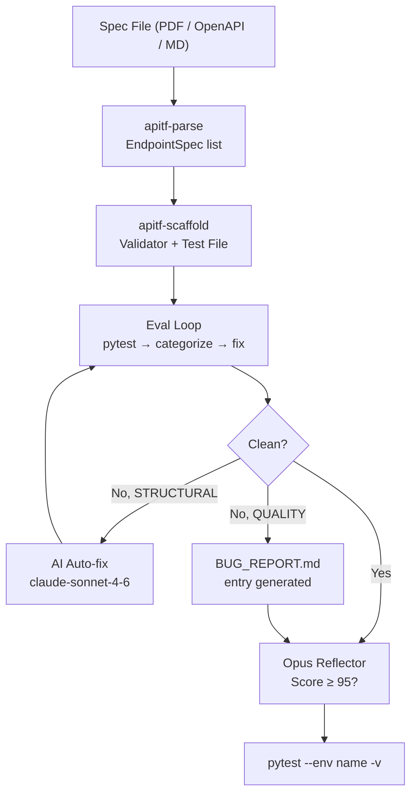
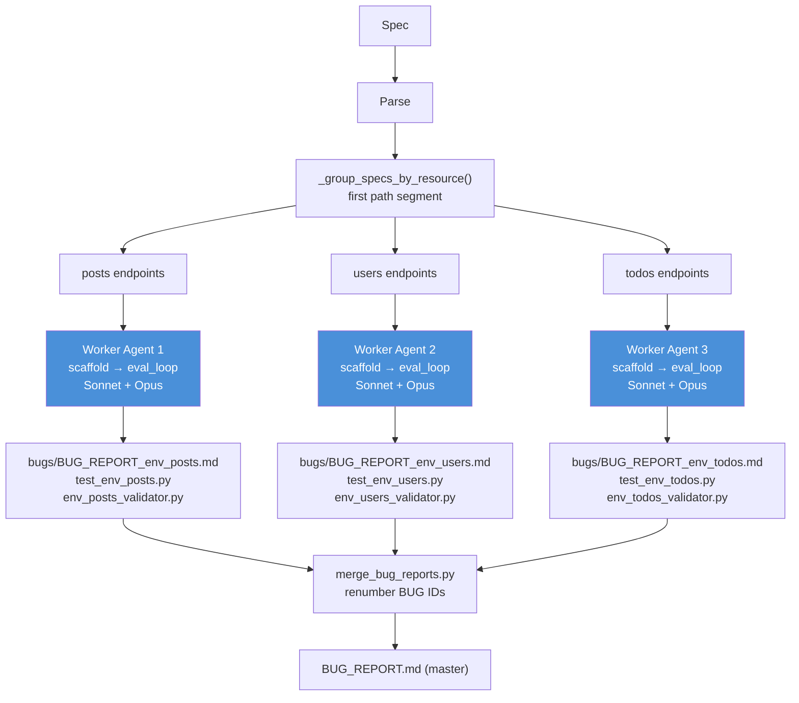
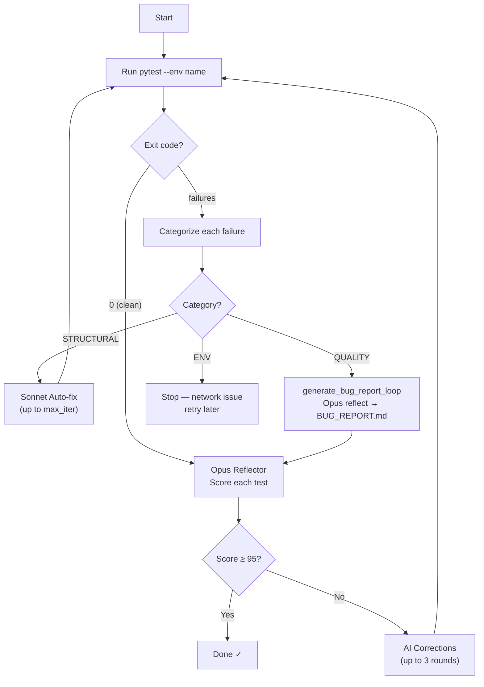
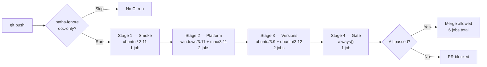
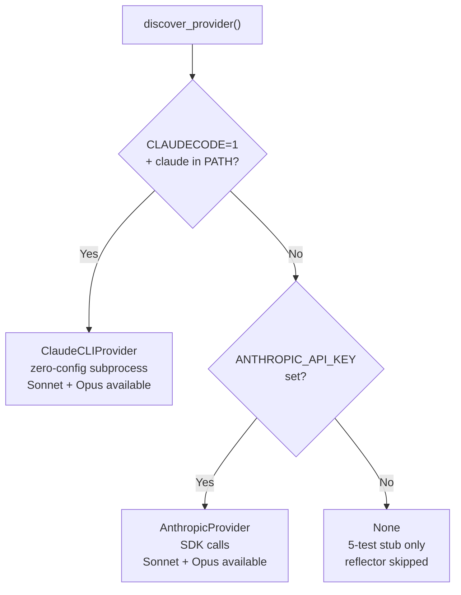
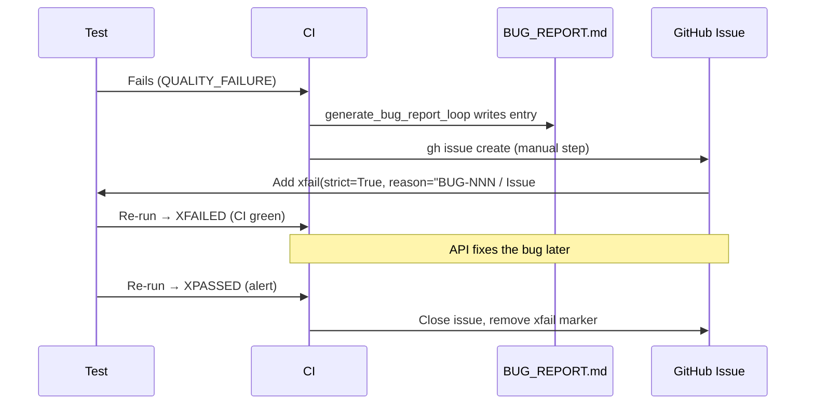
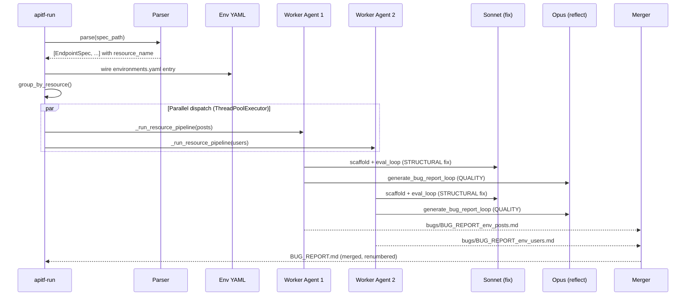

# API Test Framework

[](https://github.com/sks-54/api-test-framework/actions/workflows/ci.yml)
[](https://www.python.org)
[](https://pytest.org)
[](https://allurereport.org)

A production-grade, multi-environment API test framework. Point it at a spec document (PDF, OpenAPI, or Markdown), and it extracts endpoint definitions, generates typed validators, and produces complete pytest test files — driven by YAML config and Claude AI, with zero manual scaffolding.

Ships with three reference environments: **REST Countries**, **Open-Meteo**, and **JSONPlaceholder** (108 tests, 10 testing techniques, Allure reporting, 4-stage CI matrix).

---

## Table of Contents

1. [How It Works](#how-it-works)
2. [Install](#install)
3. [Run Tests](#run-tests)
4. [The 108 Tests — Full Breakdown](#the-108-tests--full-breakdown)
5. [Generate Tests from a Spec](#generate-tests-from-a-spec)
6. [Parallel Multi-Agent Pipeline](#parallel-multi-agent-pipeline)
7. [Add a New API (3 steps)](#add-a-new-api-3-steps)
8. [Test Design Techniques](#test-design-techniques)
9. [AI Providers](#ai-providers)
10. [Project Layout](#project-layout)
11. [Architecture](#architecture)
12. [Framework Rules Summary](#framework-rules-summary)
13. [CI Pipeline](#ci-pipeline)
14. [Bug Lifecycle](#bug-lifecycle)

---

## How It Works

```
Spec file  →  apitf-parse  →  EndpointSpec list
                                     │
                         group by resource (path segment)
                                     │
                    ┌────────────────┼────────────────┐
                    │                │                │
               Worker 1          Worker 2         Worker 3
               scaffold          scaffold         scaffold
               eval_loop         eval_loop        eval_loop
                    │                │                │
              BUG_REPORT_       BUG_REPORT_       BUG_REPORT_
              env_posts.md      env_users.md      env_todos.md
                    └────────────────┼────────────────┘
                               merge_bug_reports.py
                                     │
                               BUG_REPORT.md
```

Each worker is an independent agent: it scaffolds a validator class and test file for its resource group, runs the eval loop (pytest → categorize → AI fix → repeat), and writes its own isolated bug report. Workers run in parallel via `ThreadPoolExecutor`. Single-resource specs (countries, weather) use a fast sequential path.

---

## Install

```bash
git clone https://github.com/sks-54/api-test-framework.git
cd api-test-framework

# macOS / Linux
python3 -m venv .venv && source .venv/bin/activate

# Windows (PowerShell)
python -m venv .venv; .\.venv\Scripts\Activate.ps1

pip install --upgrade pip && pip install -e ".[test]"
python scripts/setup_hooks.py   # installs pre-push bug-marker check
```

See `INSTALL.md` for detailed Windows notes, CMD alternatives, and AI provider setup.

---

## Run Tests

```bash
# Single environment
pytest --env countries -q          # REST Countries (22 tests)
pytest --env weather -q            # Open-Meteo (24 tests, 6 xfail SLA violations)
pytest --env jsonplaceholder -q    # JSONPlaceholder (26 tests, 1 xfail)

# All environments + security + baseline
pytest -q                          # 108 tests total

# With Allure report
pytest -q --alluredir=allure-results
allure serve allure-results        # opens browser
```

---

## The 108 Tests — Full Breakdown

The suite is split across five test files. Every live-HTTP test has `@pytest.mark.flaky(reruns=2, reruns_delay=2)` for transient network tolerance. Environment-scoped tests skip automatically when `--env` selects a different environment.

### `test_countries.py` — 22 tests, REST Countries API

| ID | Test | Technique | Notes |
|----|------|-----------|-------|
| TC-C-001 | `test_get_country_by_name_positive` | Positive | GET /name/germany → 200 + schema valid |
| TC-C-002 | `test_get_countries_by_region_positive` | Positive | GET /region/europe → 200 |
| TC-C-003 | `test_get_all_countries_with_fields_positive` | Positive | GET /all?fields=name,population → 200 |
| TC-C-004 | `test_get_country_by_name_equivalence_france` | Equivalence | France is representative of valid name class |
| TC-C-005 | `test_get_countries_by_region_equivalence_asia` | Equivalence | Asia is representative of valid region class |
| TC-C-006 | `test_response_content_type_is_json` | Boundary | Content-Type: application/json enforced |
| TC-C-007 | `test_get_country_minimum_name_length` | Boundary | Single-character name edge case |
| TC-C-008 | `test_get_country_with_all_required_fields_filter` | Boundary | fields= filter returns exact fields |
| TC-C-009 | `test_partial_name_match_returns_multiple_results` | Boundary | Partial name → multiple results |
| TC-C-010 | `test_get_nonexistent_country_returns_404` | Negative | unknowncountryxyz → exact 404 |
| TC-C-011 | `test_get_nonexistent_region_returns_404` | Negative | /region/invalidregion → exact 404 |
| TC-C-012 | `test_get_country_numeric_name_returns_404` | Negative | /name/99999 → exact 404 |
| TC-C-013 | `test_get_country_by_name_performance` | Performance | response_time_ms < YAML threshold |
| TC-C-014 | `test_get_region_europe_performance` | Performance | /region/europe SLA |
| TC-C-015 | `test_get_all_countries_performance` | Performance | /all SLA |
| TC-C-016 | `test_https_enforcement` | Security | HTTP base_url → ValueError (no socket) |
| TC-C-017 | `test_germany_response_contains_required_fields` | State-based | name, capital, population, currencies, languages |
| TC-C-018 | `test_germany_state_values` | State-based | cca2=DE, region=Europe, independent=True |
| TC-C-019 | `test_europe_region_returns_multiple_countries` | State-based | result count > 40 |
| TC-C-020 | `test_all_countries_returns_full_list` | State-based | all population > 0 |
| TC-C-021 | `test_alpha_invalid_code_returns_404_xfail` | Negative | xfail — API returns wrong code |
| TC-C-022 | `test_all_countries_population_nonzero_xfail` | Boundary | xfail — known data quality issue |

### `test_weather.py` — 22 tests, Open-Meteo API

| ID | Test | Technique | Notes |
|----|------|-----------|-------|
| TC-W-001 | `test_forecast_valid_request` | Positive | GET /forecast?lat=52.52&lon=13.41 → 200 |
| TC-W-002 | `test_forecast_hourly_temperature_returns_200` | Positive | hourly=temperature_2m |
| TC-W-003 | `test_forecast_daily_temperature_max_returns_200` | Positive | daily=temperature_2m_max |
| TC-W-004 | `test_forecast_with_timezone_returns_200` | Positive | timezone field present |
| TC-W-005 | `test_equivalence_european_coordinates` | Equivalence | Paris coords — same class as Berlin |
| TC-W-006 | `test_equivalence_southern_hemisphere_coordinates` | Equivalence | Sydney coords — southern hemisphere class |
| TC-W-007 | `test_boundary_min_latitude` | Boundary | lat=-90 (minimum valid) |
| TC-W-008 | `test_boundary_max_latitude` | Boundary | lat=90 (maximum valid) |
| TC-W-009 | `test_boundary_min_longitude` | Boundary | lon=-180 (minimum valid) |
| TC-W-010 | `test_boundary_max_longitude` | Boundary | lon=180 (maximum valid) |
| TC-W-011 | `test_negative_missing_latitude` | Negative | no lat param → 400 |
| TC-W-012 | `test_negative_missing_longitude` | Negative | no lon param → 400 |
| TC-W-013 | `test_negative_latitude_exceeds_max` | Error Handling | lat=999 → 400 (out-of-range) |
| TC-W-014 | `test_negative_non_numeric_latitude` | Error Handling | lat=abc → 400 |
| TC-W-015 | `test_negative_empty_latitude` | Error Handling | lat= (empty) → 400 |
| TC-W-016 | `test_boundary_forecast_days_min` | Boundary | forecast_days=1 (minimum) |
| TC-W-017 | `test_boundary_forecast_days_max` | Boundary | forecast_days=16 (maximum) |
| TC-W-018 | `test_performance_forecast_response_time` | Performance | response_time_ms < YAML threshold |
| TC-W-019 | `test_security_https_enforcement` | Security | HTTP base_url → ValueError |
| TC-W-020 | `test_state_forecast_required_fields_present` | State-based | latitude, longitude, hourly present |
| TC-W-021 | `test_state_forecast_latitude_reflects_request` | State-based | returned lat matches requested lat |
| TC-W-022 | `test_state_forecast_hourly_key_present` | State-based | hourly.time non-empty |

### `test_jsonplaceholder.py` — 26 tests, JSONPlaceholder API

| ID | Test | Technique | Notes |
|----|------|-----------|-------|
| TC-J-001 | `test_get_post_by_id_positive` | Positive | GET /posts/1 → 200 + schema |
| TC-J-002 | `test_get_posts_list_positive` | Positive | GET /posts → 200, list non-empty |
| TC-J-003 | `test_get_post_comments_positive` | Positive | GET /posts/1/comments → 200 |
| TC-J-004 | `test_get_user_by_id_positive` | Positive | GET /users/1 → 200 + schema |
| TC-J-005 | `test_get_todo_by_id_positive` | Positive | GET /todos/1 → 200 + schema |
| TC-J-006 | `test_get_album_by_id_positive` | Positive | GET /albums/1 → 200 + schema |
| TC-J-007 | `test_get_post_mid_range_equivalence` | Equivalence | post id=50 — mid-range valid class |
| TC-J-008 | `test_get_user_mid_range_equivalence` | Equivalence | user id=5 — mid-range valid class |
| TC-J-009 | `test_get_post_minimum_id_boundary` | Boundary | post id=1 (minimum valid) |
| TC-J-010 | `test_get_post_out_of_range_boundary` | Boundary | post id=101 (one above max) → 404 |
| TC-J-011 | `test_get_user_minimum_id_boundary` | Boundary | user id=1 (minimum valid) |
| TC-J-012 | `test_get_post_zero_id_negative` | Negative | post id=0 → 404 |
| TC-J-013 | `test_get_user_not_found_negative` | Negative | user id=9999 → 404 |
| TC-J-014 | `test_get_todo_not_found_negative` | Negative | todo id=9999 → 404 |
| TC-J-015 | `test_get_album_not_found_negative` | Negative | album id=9999 → 404 |
| TC-J-016 | `test_get_posts_list_performance` | Performance | GET /posts SLA |
| TC-J-017 | `test_get_post_by_id_performance` | Performance | GET /posts/1 SLA |
| TC-J-018 | `test_get_user_by_id_performance` | Performance | GET /users/1 SLA |
| TC-J-019 | `test_get_todo_by_id_performance` | Performance | GET /todos/1 SLA |
| TC-J-020 | `test_https_enforcement_security` | Security | HTTP base_url → ValueError |
| TC-J-021 | `test_get_post_state_required_fields` | State-based | userId, id, title, body present |
| TC-J-022 | `test_get_post_comments_state_postid_consistency` | State-based | comment.postId == requested id |
| TC-J-023 | `test_get_user_state_required_fields` | State-based | id, name, username, email present |
| TC-J-024 | `test_get_todo_state_fields` | State-based | userId, id, title, completed present |
| TC-J-025 | `test_get_posts_list_state_count_and_fields` | State-based | 100 posts, all have required fields |
| TC-J-026 | `test_get_comments_nonexistent_post_xfail` | Negative | xfail — known API behavior |

### `test_security.py` — 24 tests, Cross-Environment Security

| Group | Tests | Coverage |
|-------|-------|----------|
| Method enforcement | `test_method_not_allowed[countries/weather × POST/DELETE/PUT/PATCH]` (8 tests) | Write methods rejected on read-only APIs |
| Content negotiation | `test_content_negotiation_406[countries/weather]` (2 tests) | Non-JSON Accept header → 406 |
| Security headers | `test_security_headers_present[countries/weather]` (2 tests) | HSTS, X-Frame-Options, X-Content-Type-Options |
| Injection safety | `test_injection_safe[countries/weather × sql/path_traversal/xss/null_byte/crlf/cmd]` (12 tests) | 6 OWASP attack vectors per environment |

### `test_baseline.py` — 12 tests, Cross-Environment Baseline

Parametrized across all three environments (jsonplaceholder, countries, weather):

| Test | Coverage |
|------|----------|
| `test_https_enforced` × 3 | HTTP base_url rejected by HttpClient |
| `test_positive_baseline` × 3 | Primary endpoint returns 200 |
| `test_invalid_path_404` × 3 | /nonexistent-path-xyz → 404 |
| `test_performance_threshold` × 3 | Primary endpoint SLA from YAML |

### Summary

| File | Tests | xfail | Technique coverage |
|------|-------|-------|--------------------|
| test_countries.py | 22 | 2 | All 10 techniques |
| test_weather.py | 24 | 0 (6 SLA xfails during SLA violations) | All 10 techniques |
| test_jsonplaceholder.py | 26 | 1 | All 10 techniques |
| test_security.py | 24 | 0 | Negative, Security, Error Handling |
| test_baseline.py | 12 | 0 | Positive, Performance, Security |
| **Total** | **108** | **3+** | **10 techniques** |

---

## Generate Tests from a Spec

The `apitf-run` command parses a spec, generates test code, runs the eval loop, and writes the results.

```bash
# Inside a Claude Code session — no API key needed
apitf-run specs/myapi.pdf --env myapi

# Outside Claude Code — requires ANTHROPIC_API_KEY
export ANTHROPIC_API_KEY=sk-ant-...
apitf-run specs/myapi.pdf --env myapi

# Force sequential mode (debug)
apitf-run specs/myapi.pdf --env myapi --no-parallel

# Parse only (no test generation)
apitf-parse specs/myapi.pdf --env myapi
```

The eval loop:
1. Generates validator + test file from the spec
2. Runs `pytest --env <name>` and captures output
3. Categorizes each failure: `STRUCTURAL` (code error) | `QUALITY` (spec deviation) | `ENV` (network)
4. Auto-fixes STRUCTURAL failures with Sonnet (up to `max_iter` rounds)
5. Files QUALITY failures in `BUG_REPORT.md` via the Opus reflector
6. Repeats until the suite is clean or the budget is exhausted

---

## Parallel Multi-Agent Pipeline

When a spec contains multiple resource groups (e.g., `/posts`, `/users`, `/todos`), `apitf-run` dispatches a separate worker agent per resource. Workers run concurrently via `ThreadPoolExecutor(max_workers=min(n_resources, 4))`.

### Worker lifecycle

```
                         apitf-run
                              │
              ┌───────────────┼───────────────┐
              │               │               │
         Worker 1         Worker 2         Worker 3
         (posts)          (users)          (todos)
              │               │               │
         scaffold         scaffold         scaffold
         validator        validator        validator
              │               │               │
         eval_loop        eval_loop        eval_loop
          ↙  ↘             ↙  ↘            ↙  ↘
      pytest  AI-fix   pytest  AI-fix  pytest  AI-fix
              │               │               │
         BUG_REPORT_      BUG_REPORT_     BUG_REPORT_
         env_posts.md     env_users.md    env_todos.md
              └───────────────┼───────────────┘
                              │
                   merge_bug_reports.py
                   (renumber BUG IDs, append)
                              │
                        BUG_REPORT.md
```

### Per-resource outputs

Each worker creates three files:
- `tests/test_{env}_{resource}.py` — the test file for this resource group
- `apitf/validators/{env}_{resource}_validator.py` — the typed validator
- `bugs/BUG_REPORT_{env}_{resource}.md` — isolated bug report (no locking needed)

### Single-resource specs

For specs with only one resource group (countries, weather), the sequential path is used unchanged. Parallel dispatch is skipped entirely — no overhead.

---

## Add a New API (3 steps)

```
1. config/environments.yaml      — add base_url and thresholds
2. apitf/validators/<name>.py    — extend BaseValidator, define required fields
3. tests/test_<name>.py          — use HttpClient + env_config fixture
```

No framework changes needed. The `--env` flag routes to the new entry automatically.

### environments.yaml entry

```yaml
myapi:
  base_url: "https://api.example.com/v1"
  thresholds:
    max_response_time: 2.0
```

### Validator

```python
from apitf.validators.base_validator import BaseValidator, ValidationResult
from typing import Any

class MyApiValidator(BaseValidator):
    def validate(self, data: Any) -> ValidationResult:
        for field in ("id", "name", "status"):
            if field not in data:
                self._fail(f"Missing required field: {field!r}")
        return self._pass()
```

### Test

```python
import pytest
import allure
from apitf.http_client import HttpClient
from apitf.validators.myapi_validator import MyApiValidator

pytestmark = [pytest.mark.myapi, allure.suite("myapi")]

@allure.title("TC-001: Positive — GET /resource/1 returns 200 and passes schema")
@pytest.mark.flaky(reruns=2, reruns_delay=2)
def test_get_resource_positive(env_config: dict) -> None:
    cfg = env_config["myapi"]
    with HttpClient(cfg["base_url"]) as client:
        resp = client.get("/resource/1")
    assert resp.status_code == 200
    result = MyApiValidator().validate(resp.json_body)
    assert result.passed, result.errors
```

---

## Test Design Techniques

All 10 techniques are applied across every environment. See `wiki/Test-Design-Techniques.md` for examples from the live test suite.

| # | Technique | Description | Where applied |
|---|-----------|-------------|---------------|
| 1 | **Equivalence Partitioning** | Test a representative value from each valid input class | countries TC-004/005, weather TC-005/006, JP TC-007/008 |
| 2 | **Boundary Value Analysis** | Test at exact edges of valid ranges | weather TC-007–010/016/017, countries TC-007/008/009 |
| 3 | **Positive (Happy Path)** | Standard valid request returns 200 + correct body | All environments TC-001–003 |
| 4 | **Negative (Error Paths)** | Invalid inputs return the exact specified error code | countries TC-010–012, weather TC-011–015, JP TC-012–015 |
| 5 | **Performance / SLA** | Response time within YAML threshold (never hardcoded) | countries TC-013–015, weather TC-018, baseline all |
| 6 | **Reliability** | `@pytest.mark.flaky(reruns=2)` on every live HTTP test | All test_*.py |
| 7 | **Security** | HTTPS enforcement + OWASP injection vectors + security headers | test_security.py, per-env TC-016/019/020 |
| 8 | **State-Based / Cross-Reference** | Two endpoints maintain consistent state | countries TC-017–020, weather TC-020–022 |
| 9 | **Error Handling** | Malformed/out-of-range input → 4xx, never 5xx | weather TC-013–015, security injection tests |
| 10 | **Compatibility** | Framework runs on Python 3.9/3.11/3.12 and macOS/Windows/Linux | CI matrix Stage 2+3 |

**Framework enforcement on assertions:**
- `assert resp.status_code == 404` ✓ — exact code required
- `assert resp.status_code in (400, 404)` ✗ — forbidden, hides spec deviations
- `assert resp.response_time_ms < cfg["thresholds"]["max_response_time"] * 1000` ✓
- `assert resp.response_time_ms < 2000` ✗ — hardcoded, violates Rule 1

---

## AI Providers

| Priority | Provider | When used |
|----------|----------|-----------|
| 1 | `ClaudeCLIProvider` | Inside a Claude Code session (`CLAUDECODE=1`) — zero config |
| 2 | `AnthropicProvider` | `ANTHROPIC_API_KEY` set in env or `.env` file |
| — | None | Baseline stub only (5 tests, no eval loop) |

Provider selection is automatic via `discover_provider()`. Model selection is lazy — the framework defaults to the best available model and falls back on first use.

**Models used:**

| Task | Model |
|------|-------|
| Test generation, auto-fix (STRUCTURAL) | `claude-sonnet-4-6` |
| Opus reflector — bug categorization, quality scoring | `claude-opus-4-7` |
| PR advisor review (`scripts/advisor_review.py`) | `claude-opus-4-7` |

---

## Project Layout

```
apitf/
  http_client.py          Shared HTTP wrapper: retry, timing, HTTPS enforcement
  eval_loop.py            generate → run pytest → categorize → fix → repeat
  cli.py                  apitf-run + apitf-parse CLI entry points
  sla_exceptions.py       SLA_FAILURE_EXCEPTIONS tuple (Rule 22)
  providers/
    base.py               LLMProvider ABC + ProviderModels dataclass
    claude_cli.py         ClaudeCLIProvider: subprocess, lazy model, signal cleanup
    anthropic.py          AnthropicProvider: SDK calls, ANTHROPIC_API_KEY
    __init__.py           discover_provider() auto-selection
  validators/
    base_validator.py     BaseValidator ABC + ValidationResult
    countries_validator.py
    weather_validator.py
    jsonplaceholder_*.py  Per-resource validators (posts, users, todos, albums)
  spec_parser/
    base_parser.py        EndpointSpec dataclass + BaseSpecParser ABC
    pdf_parser.py         Full PDF → EndpointSpec implementation
    openapi_parser.py     Extensible stub (v1.1 roadmap)
    markdown_parser.py    Full Markdown → EndpointSpec implementation
  reporters/
    bug_reporter.py       BugReporterPlugin: pytest plugin, Allure attachment

config/
  environments.yaml       Single source of truth: base_url + thresholds per env

tests/
  conftest.py             env_config fixture (session-scoped), --env CLI flag, skip logic
  test_countries.py       22 REST Countries tests
  test_weather.py         24 Open-Meteo tests (6 xfail SLA violations)
  test_jsonplaceholder.py 26 JSONPlaceholder tests (AI-generated, 1 xfail)
  test_security.py        24 cross-environment security tests
  test_baseline.py        12 cross-environment baseline tests (4 × 3 envs)

test_data/
  cities.json             5 cities with lat/lon for weather parametrize

specs/
  home_test.PDF           Original spec document
  jsonplaceholder.md      Markdown spec for JSONPlaceholder (6 endpoints)

bugs/
  BUG_REPORT_{env}_{resource}.md    Per-resource worker bug reports (parallel pipeline)

scripts/
  push.py                 push + CI monitor (replaces git push — Rule 18)
  setup_hooks.py          Installs pre-push git hook
  verify_bug_markers.py   Checks every open BUG_REPORT.md entry has xfail marker
  merge_bug_reports.py    Consolidates bugs/ into master BUG_REPORT.md
  advisor_review.py       Opus advisor review stub (SDK pattern)

.claude/
  rules/                  27 machine-enforced framework rules
    framework-rules.md
    testing-standards.md
    code-style.md
    document-parsing.md
  skills/                 Claude Code skills for test generation
    test-generator.md
    validator-generator.md
    spec-parser.md

wiki/
  Home.md                 Navigation index
  Framework-Components.md  Detailed component reference
  Bug-Lifecycle.md        End-to-end bug tracking protocol
  Design-Decisions.md     Architecture decision records
  Rules-Reference.md      27-rule reference
  Troubleshooting.md      Common failure patterns
  Allure-Report-Guide.md  Allure setup, filtering, xfail/xpass interpretation
  Test-Design-Techniques.md  10 techniques with live code examples

BUG_REPORT.md             Master bug log (curl reproduction commands mandatory — Rule 24)
DELIVERABLES.md           Spec requirements tracker
CLAUDE_LOG.md             Phase log, Opus review results, process violations
ENHANCEMENTS.md           Post-v3.0.0 roadmap
```

---

## Architecture

### 1. Framework Overview



### 2. Parallel Multi-Agent Pipeline



Single-resource specs (countries, weather) skip parallelism — sequential path unchanged. `--no-parallel` forces sequential for debugging.

### 3. Eval Loop (Per Worker)



### 4. CI Pipeline



### 5. AI Provider Auto-Discovery



### 6. Bug Lifecycle



### 7. Multi-Agent Test Generation Flow



---

## Framework Rules Summary

27 rules govern every aspect of this framework. Full text in `.claude/rules/framework-rules.md`.

| Rule | Summary | Enforcement |
|------|---------|-------------|
| 1 | Zero hardcoded values — all thresholds from `environments.yaml` | Code review, Opus audit |
| 2 | URL atomicity — never split URLs across lines or f-strings | Code review |
| 3 | Validator contract — `validate()` collects ALL errors, never short-circuits | Code review |
| 4 | Test isolation — no shared mutable state between tests | Code review |
| 5 | Extensibility gate — new API = 3 steps max, no framework changes | Code review |
| 6 | Dry-run before pip install | Rule 8 checklist |
| 7 | Opus review must include `requirements.txt` | Review prompt template |
| 8 | Pre-push checklist (6 mandatory steps) | git pre-push hook |
| 8a | Every rule must be enforced by a mechanism | Architecture review |
| 9 | No direct pushes to main | Branch protection |
| 10 | Failure categorization: ENV / QUALITY / STRUCTURAL | Eval loop |
| 11 | Review iteration budgets (3 test plan, 5 code) | Eval loop counter |
| 12 | Company name sanitization scan before every push | Rule 8 checklist |
| 13 | Opus review is mandatory pre-commit gate | Session protocol |
| 14 | No secrets in source files — env vars only | Code review |
| 15 | Named logger per module, no PII | Code review |
| 16 | Tests encode spec contract, not observed behavior | Code review |
| 17 | Always test against real endpoints — no mocks in test files | Code review |
| 18 | CI monitoring mandatory after every push | `scripts/push.py` blocks until done |
| 19 | Every CI failure → GitHub issue before merge | Branch protection + gate job |
| 20 | Session start: Opus project audit before any implementation | Session protocol |
| 21 | SLA violations are bugs — never raise thresholds | Code review |
| 22 | SLA xfail `raises=SLA_FAILURE_EXCEPTIONS` (not inline tuple) | Code review |
| 23 | Pre-commit scan for widened assertions | git hook |
| 23b | Post-rebase: run `verify_bug_markers.py` | Rule 8 checklist |
| 24 | Bug reports must include curl reproduction command | `generate_bug_report_loop` |
| 25 | Agreed changes must be written to file before next commit | Session protocol |
| 26 | CI matrix: test dimensions independently (not cartesian product) | CI config |
| 27 | Keep GitHub Actions on current Node.js runtime (v24) | Session start check |

---

## CI Pipeline

4-stage matrix enforced by branch protection:

```
Stage 1 — Smoke     : ubuntu / 3.11                (1 job)
Stage 2 — Platform  : windows/3.11, mac/3.11        (2 jobs)
Stage 3 — Versions  : ubuntu/3.9, ubuntu/3.12       (2 jobs)
Stage 4 — Gate      : always() — blocks merge        (1 job)
```

**Total: 6 jobs per push.** OS compat and Python version compat are tested as independent dimensions (Rule 26) — not as a cartesian product.

**What triggers CI:**
- Push to any non-main branch with non-doc-only changes
- Pull requests to any branch

**What skips CI:**
- Pushes where all changed files are `*.md`, `docs/`, `specs/`, `BUG_REPORT.md`, `CLAUDE_LOG.md`

Push via `python scripts/push.py` — it pushes and watches CI to completion (Rule 18).

**Action versions (Node.js 24-compatible):**
```yaml
actions/checkout@v6.0.2
actions/setup-python@v6.2.0
actions/cache@v5.0.5
actions/upload-artifact@v7.0.1
```

---

## Bug Lifecycle

1. Test fails → categorize: `ENV_FAILURE` | `QUALITY_FAILURE` | `SLA_VIOLATION`
2. `QUALITY_FAILURE` / `SLA_VIOLATION` → file GitHub issue with `gh issue create`
3. Add entry to `BUG_REPORT.md` (curl field mandatory — Rule 24)
4. Mark test `@pytest.mark.xfail(strict=True, raises=..., reason="BUG-NNN / Issue #N: ...")`
5. CI goes green; `XPASSED` fires when the API fixes the bug
6. On `XPASSED`: close the GitHub issue, remove the `xfail` marker

See `.claude/rules/framework-rules.md` for the full 27-rule enforcement protocol.
See `wiki/Bug-Lifecycle.md` for end-to-end workflow with examples.
