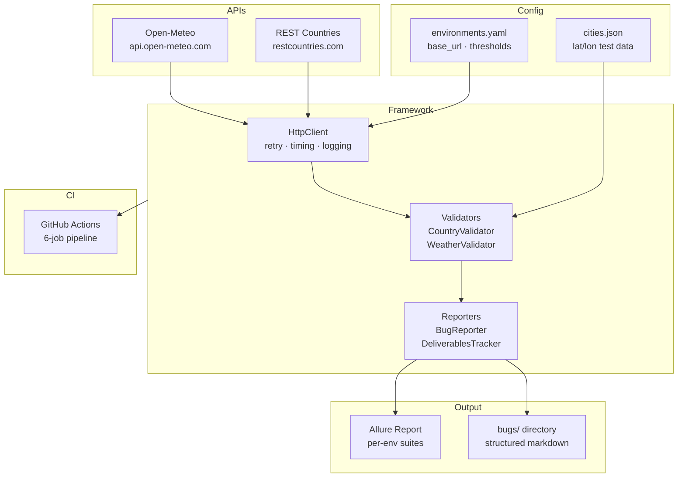
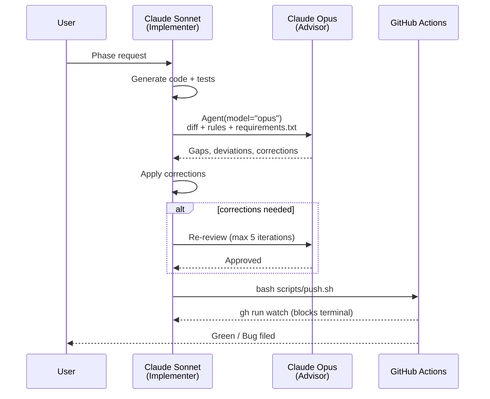
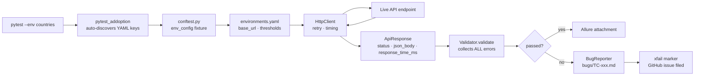
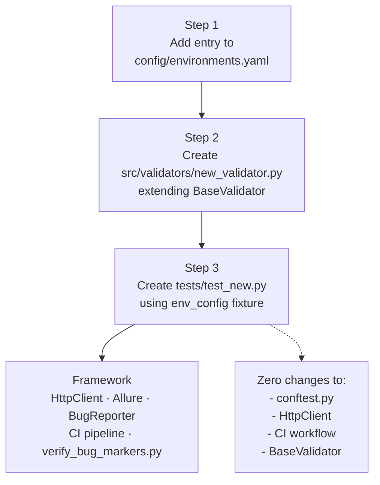
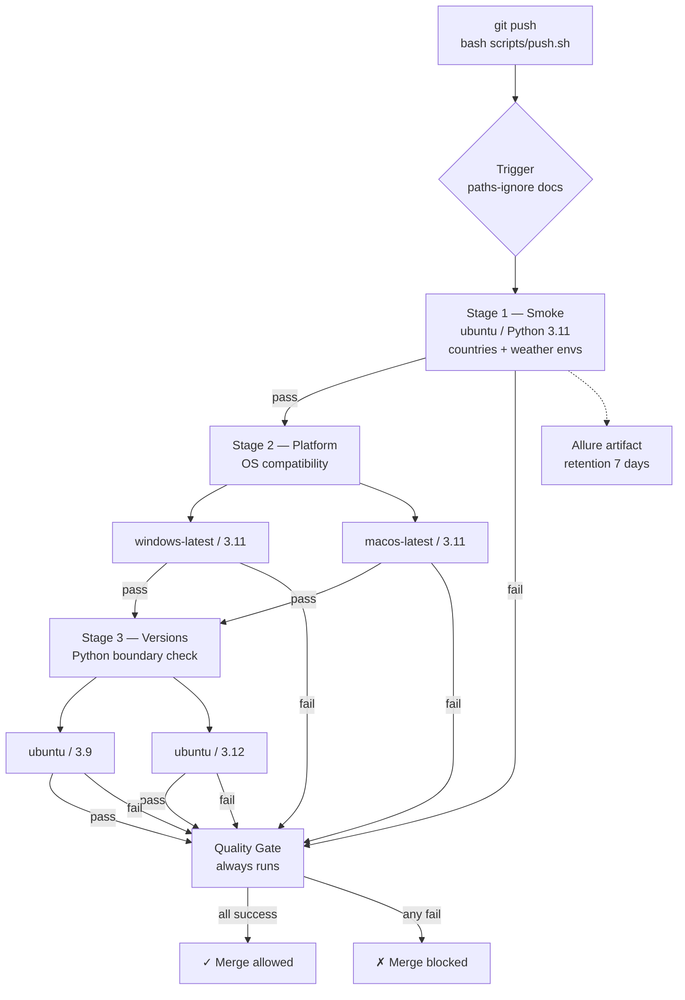

# API Test Framework

[](https://github.com/sks-54/api-test-framework/actions/workflows/ci.yml)
[](https://www.python.org)
[](https://pytest.org)

Extensible multi-environment API test framework. Add a new API by editing config and adding a validator — zero framework changes required.

---

## Architecture

### 1. System Overview



### 2. Multi-Agent Review Workflow



### 3. Test Execution Flow



### 4. Extensibility — Add a New API in 3 Steps



### 5. CI Pipeline



---

## Setup

```bash
git clone https://github.com/sks-54/api-test-framework.git
cd api-test-framework
pip install -r requirements.txt
bash scripts/setup_hooks.sh    # installs git pre-push hook (run once)
```

---

## Running Tests

```bash
# Single environment
python3 -m pytest --env countries -v --alluredir=allure-results
python3 -m pytest --env weather   -v --alluredir=allure-results

# All environments
python3 -m pytest -v --alluredir=allure-results

# View Allure report
allure serve allure-results
```

---

## Adding a New API

1. **`config/environments.yaml`** — add a new top-level key:
   ```yaml
   myapi:
     base_url: "https://api.example.com/v1"
     thresholds:
       max_response_time: 3.0
       min_results_count: 1
   ```

2. **`src/validators/myapi_validator.py`** — extend `BaseValidator`:
   ```python
   from src.validators.base_validator import BaseValidator, ValidationResult

   class MyApiValidator(BaseValidator):
       def validate(self, data: dict) -> ValidationResult:
           errors: list[str] = []
           if "id" not in data:
               errors.append("Missing required field: id")
           return self._pass() if not errors else self._fail(errors)
   ```

3. **`tests/test_myapi.py`** — use the `env_config` fixture:
   ```python
   import pytest, allure
   from src.http_client import HttpClient
   from src.validators.myapi_validator import MyApiValidator

   pytestmark = [pytest.mark.myapi, allure.suite("myapi")]

   def test_myapi_schema(env_config):
       cfg = env_config["myapi"]
       with HttpClient(cfg["base_url"]) as client:
           resp = client.get("/items/1")
       assert resp.status_code == 200
       result = MyApiValidator().validate(resp.json_body)
       assert result.passed, result.errors
   ```

No changes to `conftest.py`, `HttpClient`, the CI workflow, or any framework file.

---

## Bug Report Format

Failures auto-generate a structured markdown file in `bugs/`:

```markdown
# [FAIL] test_forecast_performance[Mumbai] — SLA violation

**Steps to Reproduce:**
pytest --env weather tests/test_weather.py::test_forecast_performance[Mumbai] -v
GET https://api.open-meteo.com/v1/forecast?latitude=19.08&longitude=72.88&...

**Expected:** response_time_ms < 3000ms (from environments.yaml max_response_time: 3.0)
**Actual:** ConnectionError — server closed connection after 30s

**Data:**
- request_url: https://api.open-meteo.com/v1/forecast?...
- status_code: N/A (connection reset)
- response_time_ms: N/A
- environment: weather
```

---

## Design Decisions

| Decision | Rationale |
|----------|-----------|
| `env_config` auto-discovers YAML keys | Adding a new environment key is the only change needed — no code edits |
| `BaseValidator.validate()` collects all errors | Fail-fast hides multiple schema bugs behind the first one |
| `SLA_FAILURE_EXCEPTIONS` adapter in `src/sla_exceptions.py` | Platform-agnostic: requests normalises all OS transport errors; `AssertionError` covers slow-but-eventual responses. New platforms need zero xfail changes |
| `pytest-rerunfailures` over `pytest-retry` | `pytest-retry` silently ignores `reruns=` kwargs (uses `retries=` instead), breaking xfail in CI |
| 6-job CI instead of 3 OS × 4 Python = 12 | OS compat and Python version compat are independent dimensions — test each separately |
| `strict=False` xfail for SLA bugs | Test may pass if the API is fast enough from a nearby runner; `strict=True` would require consistent failure to avoid `xpass` surfacing |
| `xfail(strict=True)` for pure QUALITY_FAILURE | API returns wrong data per spec — should always fail until the API is fixed |
| `bash scripts/push.sh` enforces Rule 18 | Terminal blocks until CI completes — CI monitoring cannot be forgotten |
| Git pre-push hook runs `verify_bug_markers.py` | Push is blocked if any open QUALITY_FAILURE bug is missing an xfail marker |

---

## CI Pipeline Details

| Stage | Runner | Python | Purpose |
|-------|--------|--------|---------|
| Smoke | ubuntu-latest | 3.11 | Fast-fail: import errors, both API environments |
| Platform (windows) | windows-latest | 3.11 | OS path separators, encoding, tempfiles |
| Platform (mac) | macos-latest | 3.11 | OS path separators, encoding, tempfiles |
| Versions (3.9) | ubuntu-latest | 3.9 | Oldest supported — deprecated syntax, stdlib |
| Versions (3.12) | ubuntu-latest | 3.12 | Newest supported — stdlib changes, type hints |
| Quality Gate | ubuntu-latest | — | Blocks merge if any upstream stage failed |

Allure results uploaded as artifact (7-day retention) after every smoke run.
