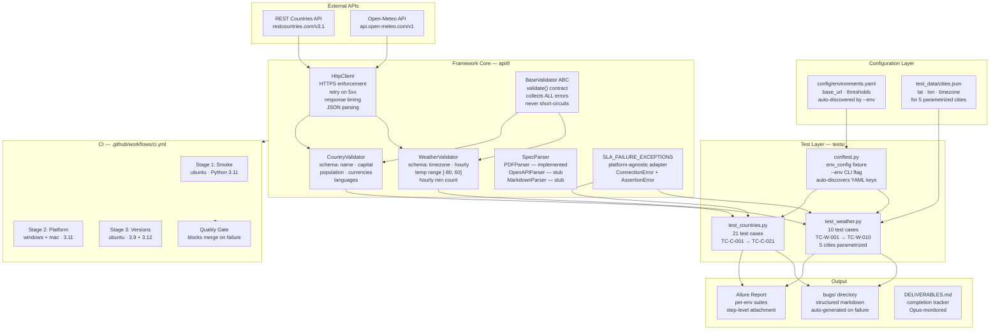
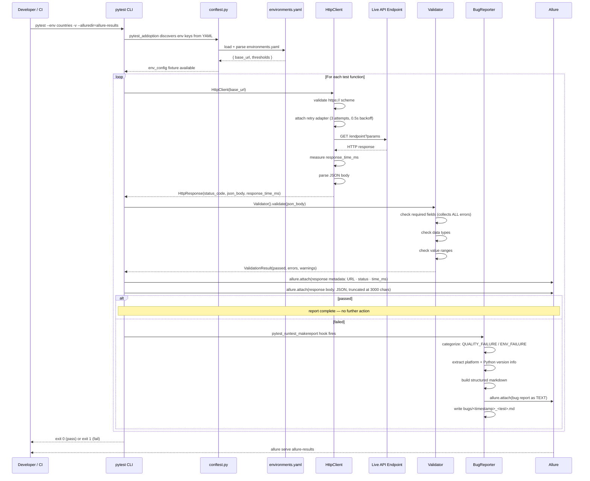
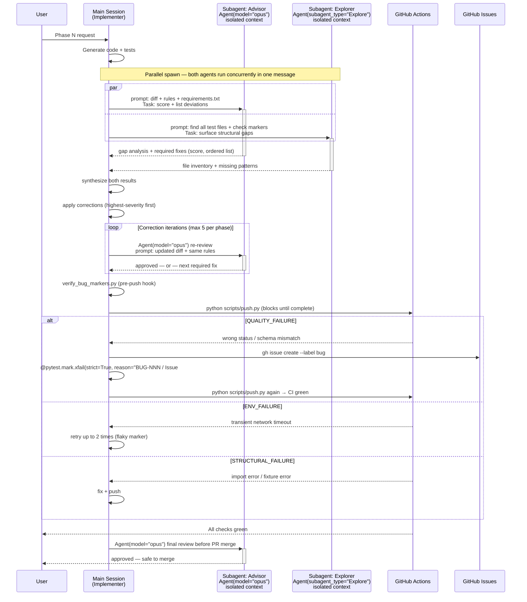
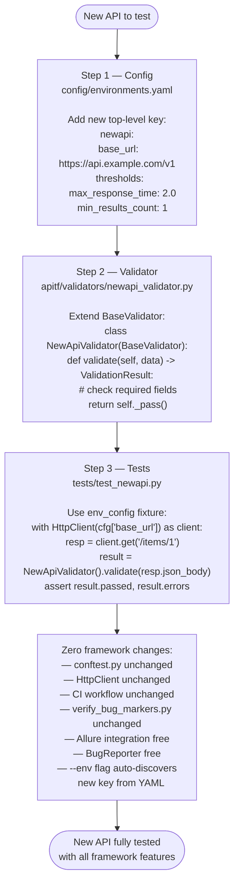
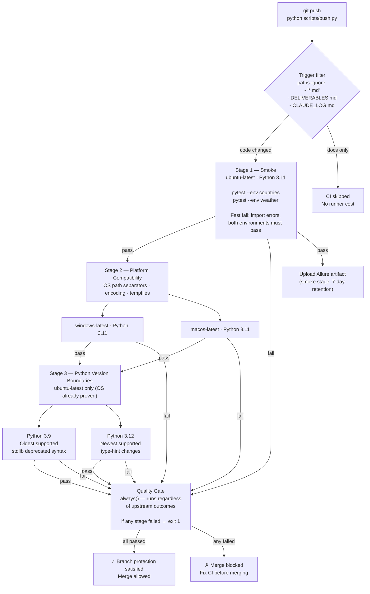
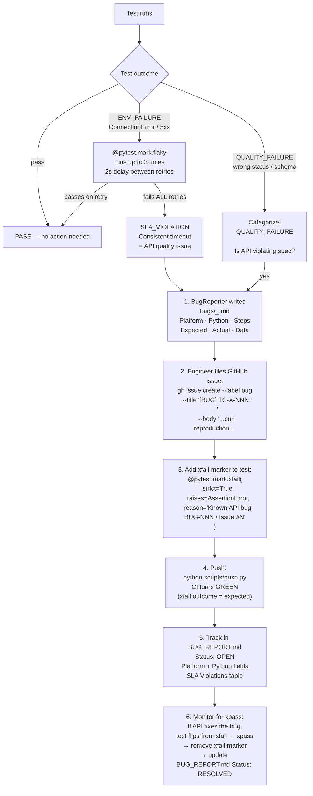
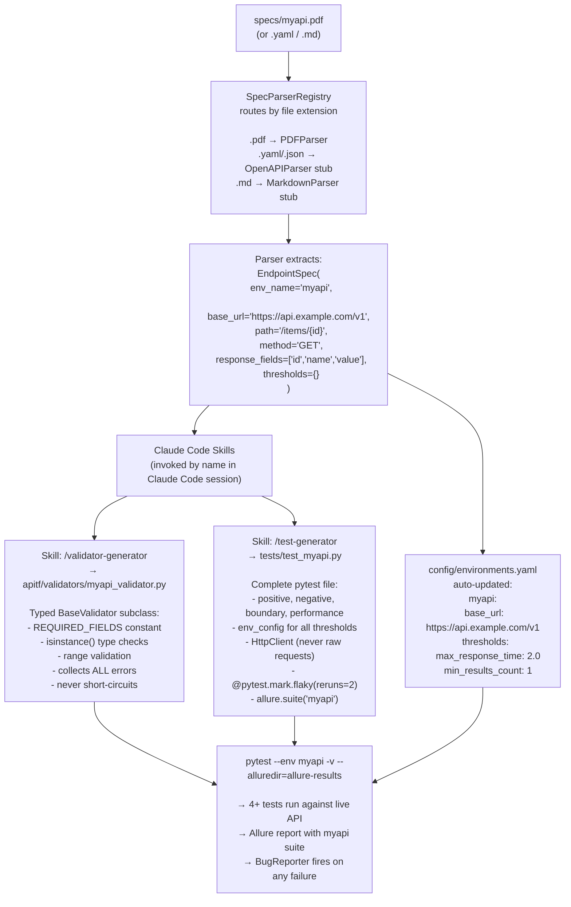

# API Test Framework

[](https://github.com/sks-54/api-test-framework/actions/workflows/ci.yml)
[](https://www.python.org)
[](https://pytest.org)
[](https://allurereport.org)
[](LICENSE)

A production-grade, extensible multi-environment API test framework. Point it at any spec document (PDF, OpenAPI, Markdown) and it extracts endpoint definitions, generates typed validators, and produces complete pytest test files — all driven by config and Claude Code skills, with zero manual scaffolding. Ships with REST Countries and Open-Meteo as reference implementations covering 31 test cases across 10 testing techniques.

---

## Table of Contents

1. [Architecture](#architecture)
2. [Project Structure](#project-structure)
3. [Quick Start](#quick-start)
4. [From Spec File to Running Tests](#from-spec-file-to-running-tests)
5. [Common Workflows](#common-workflows)
6. [Running Tests](#running-tests)
7. [Understanding the Allure Report](#understanding-the-allure-report)
8. [Using Claude Code Skills](#using-claude-code-skills)
9. [Framework Components](#framework-components)
9. [Test Coverage](#test-coverage)
10. [Test Design Techniques](#test-design-techniques)
11. [Spec-Driven Development](#spec-driven-development)
12. [Adding a New API](#adding-a-new-api)
13. [Bug Lifecycle](#bug-lifecycle)
14. [CI/CD Pipeline](#cicd-pipeline)
15. [Rules Reference](#rules-reference)
16. [Design Decisions](#design-decisions)
17. [Troubleshooting](#troubleshooting)
18. [Contributing](#contributing)

---

## Architecture

### 1. System Overview

Shows how the two APIs, framework layers, configuration, and CI all connect.



### 2. Data Flow — From CLI to Report

Shows exactly what happens from the moment you run `pytest` to when a report is produced.



### 3. Multi-Agent Development Workflow

Shows how the main Claude Code session (Implementer) spawns parallel subagents — each with its own isolated context window — and synthesizes their results before committing.

**Key mechanic:** `Agent()` is a fork. Every subagent receives a self-contained prompt and runs concurrently. No shared state — the result is a single message returned to the spawning session.



**Why each subagent gets its own context window:**
- No accumulated noise from earlier turns bleeds into the review
- Opus sees only what is in the prompt — makes the review deterministic and reproducible
- Parallel spawning means Explore (codebase search) and Opus (gap analysis) run simultaneously rather than sequentially, cutting wall-clock review time in half

### 4. Extensibility — Add a New API in 3 Steps

Shows the minimum path to extend the framework to a new API without touching any existing files.



### 5. CI Pipeline

Shows the 6-job 3-stage pipeline that enforces quality before every merge.



### 6. Bug Lifecycle

Shows how a detected bug flows from test failure to tracked GitHub issue to eventual resolution.



---

## Project Structure

```
api-test-framework/
│
├── config/
│   └── environments.yaml           # Single source of truth for all URLs + thresholds
│                                   # Add new API here — framework auto-discovers via --env
│
├── test_data/
│   └── cities.json                 # 5 cities with lat/lon for parametrized weather tests
│
├── specs/
│   └── home_test.PDF               # Source spec document (parsed by PDFParser)
│
├── apitf/                          # Framework internals — tests import from here
│   ├── __init__.py
│   ├── http_client.py              # HttpClient: HTTPS enforcement, retry, timing, logging
│   ├── sla_exceptions.py           # SLA_FAILURE_EXCEPTIONS adapter (platform-agnostic tuple)
│   │
│   ├── validators/
│   │   ├── __init__.py
│   │   ├── base_validator.py       # BaseValidator ABC: validate() contract, _fail(), _pass()
│   │   ├── country_validator.py    # CountryValidator: REST Countries schema rules
│   │   └── weather_validator.py    # WeatherValidator: Open-Meteo schema + temp range rules
│   │
│   ├── reporters/
│   │   ├── __init__.py
│   │   ├── bug_reporter.py         # pytest plugin: structured markdown bug reports on failure
│   │   └── deliverables_tracker.py # Reads DELIVERABLES.md, prints completion %
│   │
│   └── spec_parser/
│       ├── __init__.py
│       ├── base_parser.py          # EndpointSpec dataclass + BaseSpecParser ABC
│       ├── pdf_parser.py           # Fully implemented PDF spec parser (PyMuPDF)
│       ├── openapi_parser.py       # Extensibility stub — interface defined, commented intent
│       └── markdown_parser.py      # Extensibility stub — interface defined, commented intent
│
├── tests/
│   ├── __init__.py
│   ├── conftest.py                 # env_config fixture + --env CLI flag + bug reporter wiring
│   ├── test_countries.py           # 21 test cases: TC-C-001 → TC-C-021
│   ├── test_weather.py             # 10 test cases: TC-W-001 → TC-W-010 (5 cities parametrized)
│   ├── test_security.py            # RFC 7231 compliance: methods, headers, content negotiation
│   └── test_baseline.py            # Generic baselines: HTTPS, 2xx, 404, perf — auto for any env
│
├── scripts/
│   ├── advisor_review.py           # Opus advisor SDK stub (shows integration pattern)
│   ├── push.py                     # Enforces CI monitoring: push + gh run watch
│   ├── setup_hooks.py              # Installs git pre-push hook (run once after clone)
│   └── verify_bug_markers.py       # Pre-push guard: every open QUALITY_FAILURE bug needs xfail
│
├── bugs/                           # Auto-generated on test failure (gitignored results)
│
├── .github/
│   └── workflows/
│       └── ci.yml                  # 3-stage 6-job pipeline (smoke → platform → versions → gate)
│
├── .claude/
│   ├── rules/
│   │   ├── testing-standards.md   # 10 testing rules (flaky markers, parametrize, schema)
│   │   ├── code-style.md          # 8 Python style rules (type hints, validators, pathlib)
│   │   ├── framework-rules.md     # 27 rules governing phases, reviews, commits, CI
│   │   └── document-parsing.md    # 7 rules for the spec parser subsystem
│   └── skills/
│       ├── test-generator.md      # Skill: endpoint → full pytest test file
│       ├── validator-generator.md # Skill: JSON response → typed validator class
│       └── spec-parser.md         # Skill: spec doc → EndpointSpec extraction
│
├── CLAUDE.md                       # Session-start instructions (auto-loaded by Claude Code)
├── CLAUDE_LOG.md                   # Phase log: decisions, corrections, Opus reviews, bugs
├── DELIVERABLES.md                 # Spec requirements tracker (Opus-monitored)
├── BUG_REPORT.md                   # All filed bugs: format, status, curl reproduction
├── ENHANCEMENTS.md                 # Post-v2.0.0.0 roadmap
├── INSTALL.md                      # Platform-specific install guide (macOS · Linux · Windows)
├── TEST_PLAN.md                    # Full test plan (38 planned cases; 31 implemented in v2.0.0.0)
├── pytest.ini                      # markers, addopts (-v --tb=short)
├── pyproject.toml                  # Installable package (pip install -e ".[test]")
└── requirements.txt                # Pinned dependencies (legacy fallback)
```

---

## Quick Start

### Prerequisites

- Python 3.9, 3.10, 3.11, or 3.12 (CI validates 3.9 and 3.12 as boundary versions — all intermediate versions are implicitly supported)
- `pip` (included with Python)
- `git`
- `allure` CLI (optional, for viewing reports): `brew install allure` or download from [allurereport.org](https://allurereport.org)

### Installation

```bash
# 1. Clone the repository
git clone https://github.com/sks-54/api-test-framework.git
cd api-test-framework

# 2. Create and activate a virtual environment (recommended)
python3 -m venv .venv
# macOS/Linux:
source .venv/bin/activate
# Windows:
# .venv\Scripts\activate

# 3. Install dependencies
pip install --upgrade pip && pip install -e ".[test]"

# 4. Install the pre-push git hook (run once — enforces bug marker checks)
python scripts/setup_hooks.py

# 5. Verify everything is wired up
pytest --collect-only -q          # should show 88 tests, no import errors
```

### Verify Installation

```bash
# Quick smoke: run countries tests only
pytest --env countries -q

# Full run: all environments, verbose output
pytest -v --alluredir=allure-results

# View the Allure report
allure serve allure-results
```

---

## From Spec File to Running Tests

The fastest path to testing a new API: drop a spec document in `specs/`, run three Claude Code skills in sequence, and you have a working test suite — config, validator, and test file all generated automatically.

```
┌──────────────────────────────────────────────────────────────────────┐
│  1. Drop spec          │  specs/myapi.pdf  (or .yaml / .md)          │
│                        │                                              │
│  2. In Claude Code →   │  /spec-parser SPEC_PATH=specs/myapi.pdf     │
│     (extracts specs,   │   ↓ prints:                                  │
│      updates YAML,     │   EndpointSpec(env_name='myapi', ...)        │
│      prints next cmds) │   environments.yaml updated                  │
│                        │   /validator-generator ... ← copy this       │
│                        │   /test-generator ...      ← and this        │
│                        │                                              │
│  3. In Claude Code →   │  /validator-generator                        │
│     (paste the cmd     │    SAMPLE_JSON=<paste live API response>     │
│      spec-parser       │    CLASS_NAME=MyApiValidator                 │
│      printed for you)  │    OUTPUT_MODULE=myapi_validator             │
│                        │   ↓ writes apitf/validators/myapi_validator.py │
│                        │                                              │
│  4. In Claude Code →   │  /test-generator                             │
│     (paste the cmd     │    ENDPOINT_URL=https://api.example.com/v1  │
│      spec-parser       │    ENV_NAME=myapi                            │
│      printed for you)  │    VALIDATOR_CLASS=MyApiValidator            │
│                        │   ↓ writes tests/test_myapi.py               │
│                        │     4 tests: positive · negative ·           │
│                        │             boundary · performance           │
│                        │                                              │
│  5. Fill thresholds    │  config/environments.yaml                    │
│                        │    myapi:                                     │
│                        │      thresholds:                             │
│                        │        max_response_time: 2.0  ← set this   │
│                        │                                              │
│  6. Run                │  pytest --env myapi -v --alluredir=allure-results │
│                        │  allure serve allure-results                 │
└──────────────────────────────────────────────────────────────────────┘
```

**Key point:** `/spec-parser` prints the exact `/validator-generator` and `/test-generator` commands for every endpoint it finds. You copy-paste them — you do not compose the arguments manually.

**What you do not touch:**
- `conftest.py` — `--env myapi` auto-discovered from YAML
- `HttpClient` — works for any HTTPS endpoint
- CI workflow — new tests run automatically on push
- `BugReporter` — attaches to Allure and writes `bugs/` on any failure
- `verify_bug_markers.py` — pre-push guard picks up new test files via glob

For the full step-by-step with code, see [Spec-Driven Development](#spec-driven-development) and [Using Claude Code Skills](#using-claude-code-skills).

---

## Common Workflows

Quick reference for the most common tasks. All commands assume you are in the repo root with the virtualenv active.

### Run all tests and open the report

```bash
pytest -v --alluredir=allure-results   # run everything
allure serve allure-results            # open interactive report in browser
```

### Run one environment only

```bash
pytest --env countries -v --alluredir=allure-results
pytest --env weather   -v --alluredir=allure-results
```

### Re-run a single failing test

```bash
# Copy the test node ID from the pytest output
pytest tests/test_countries.py::test_germany_schema -v

# For a parametrized test, include the parameter
pytest "tests/test_weather.py::test_forecast_positive_schema[Berlin]" -v
```

### A test failed — now what?

```bash
# 1. Look at the structured bug report written to bugs/
ls bugs/                                    # one markdown file per failure
cat bugs/<timestamp>_<test_name>.md         # URL · status · time · expected · actual

# 2. Reproduce with curl (from the bug report's Steps section)
curl -s "https://restcountries.com/v3.1/alpha/ZZZ999" | python3 -m json.tool

# 3. Decide: API bug or env blip?
#    ENV_FAILURE (transient):   @pytest.mark.flaky already retries 3×. If it passed on retry, done.
#    QUALITY_FAILURE (API bug): file a GitHub issue, add xfail, push.

# 4. File the issue
gh issue create --label bug \
  --title "[BUG] TC-C-004: /alpha/ZZZ999 returns 400 instead of 404" \
  --body "$(cat bugs/<timestamp>_test_invalid_alpha_code_returns_404.md)"

# 5. Mark the test
#    In the test file, add above the def:
@pytest.mark.xfail(strict=True, raises=AssertionError,
    reason="Known API bug BUG-NNN / Issue #N: ...")

# 6. Push — CI turns green
python scripts/push.py
```

### Add a new API (3-step path)

```bash
# Step 1 — config (one block in YAML, zero code changes)
echo '
newapi:
  base_url: https://api.example.com/v1
  thresholds:
    max_response_time: 2.0
    min_results_count: 1' >> config/environments.yaml

# Step 2 — validator
# (use /validator-generator skill in Claude Code, or write manually)
# apitf/validators/newapi_validator.py — extend BaseValidator

# Step 3 — tests
# (use /test-generator skill in Claude Code, or write manually)
# tests/test_newapi.py — use env_config["newapi"] fixture

# Verify
pytest --env newapi -v --alluredir=allure-results
```

### Add tests from a spec document

```bash
# Drop the spec in specs/
cp ~/Downloads/myapi.pdf specs/

# In a Claude Code session, invoke the skill:
# /spec-parser SPEC_PATH=specs/myapi.pdf
# → extracts EndpointSpec objects, updates environments.yaml, prints skill invocations

# Then generate validator and tests (also in Claude Code):
# /validator-generator SAMPLE_JSON=... CLASS_NAME=MyApiValidator OUTPUT_MODULE=myapi_validator
# /test-generator ENDPOINT_URL=... ENV_NAME=myapi VALIDATOR_CLASS=MyApiValidator ...
```

### Check CI on an open PR

```bash
gh pr checks <PR_NUMBER>          # one-shot status
gh pr checks <PR_NUMBER> --watch  # blocks until all checks complete
```

---

## Running Tests

### By Environment

```bash
# Run only the Countries API tests
pytest --env countries -v --alluredir=allure-results

# Run only the Weather API tests
pytest --env weather -v --alluredir=allure-results

# Run ALL environments (default — no --env flag)
pytest -v --alluredir=allure-results
```

### By Test Technique Marker

```bash
# Only equivalence partition tests
pytest -m equivalence -v

# Only boundary value analysis tests
pytest -m boundary -v

# Only negative tests
pytest -m negative -v

# Only performance tests
pytest -m performance -v

# Combine markers
pytest -m "boundary and countries" -v
```

### By Test ID (single test)

```bash
pytest tests/test_countries.py::test_germany_schema -v
pytest tests/test_weather.py::test_forecast_positive_schema[Berlin] -v
```

### With Allure Reporting

```bash
# Run tests and collect Allure results
pytest -v --alluredir=allure-results

# Serve the interactive Allure report (opens in browser)
allure serve allure-results

# Generate static HTML report
allure generate allure-results -o allure-report --clean
# macOS:
open allure-report/index.html
# Windows:
# start allure-report/index.html
```

### Environment Configuration

All configuration lives in `config/environments.yaml`. The `--env` flag selects which block to activate:

```yaml
countries:
  base_url: https://restcountries.com/v3.1
  thresholds:
    max_response_time: 2.0      # seconds — performance assertion threshold
    min_results_count: 1        # minimum items in collection responses

weather:
  base_url: https://api.open-meteo.com/v1
  thresholds:
    max_response_time: 3.0
    min_results_count: 1
```

Add a new block here and it is instantly available as `--env newblock`. No code changes.

**`env_config` fixture shape:**

```python
# pytest --env countries          → env_config = {"countries": {"base_url": ..., "thresholds": {...}}}
# pytest (no --env flag)          → env_config = full YAML dict (all environments + version key)
# In tests: always access by name → cfg = env_config["countries"]
```

The `version: "1.0"` key at the top of `environments.yaml` is a schema version marker — it is preserved in the full-dict mode and ignored by test fixture access patterns.

---

## Understanding the Allure Report

After running `pytest -v --alluredir=allure-results && allure serve allure-results`, the interactive report opens in your browser. Here is what each part contains.

### Suites

The report is segmented into four top-level suites driven by `allure.suite()` in each test file's `pytestmark`:

| Suite | Source | Test functions | Collected nodes |
|-------|--------|---------------|-----------------|
| `countries` | `tests/test_countries.py` | 21 (TC-C-001 → TC-C-021) | 21 |
| `weather` | `tests/test_weather.py` | 10 (TC-W-001 → TC-W-010) | 26 (4 tests × 5 cities + 6 non-parametrized) |
| `security` | `tests/test_security.py` | RFC 7231 compliance tests | parametrized by env + violation type |
| `baseline` | `tests/test_baseline.py` | 4 generic checks per env (HTTPS, 2xx, 404, perf) | 2 envs × 4 checks = 8+ nodes |

> **Why "88 items"?** `pytest --collect-only` reports 88 nodes total — weather parametrizes 4 tests × 5 cities (20 nodes), security parametrizes by env and method/violation type, and baseline parametrizes 4 checks × 2 environments.

Running with `--env countries` hides the weather suite (those tests are skipped). Running with no `--env` flag shows both.

### Test Outcomes

| Allure colour | pytest outcome | Meaning |
|--------------|---------------|---------|
| Green | `PASSED` | API behaved as specified |
| Orange | `SKIPPED` | Environment filter active (`--env countries` skips weather tests) — or xfail/xpass (see note) |
| Red | `FAILED` | New failure — categorise and file bug immediately |

> **XFAIL / XPASS in allure-pytest 2.15.3:** Both outcomes appear as `SKIPPED` status in the Allure JSON. To distinguish them from genuine skips, click the test and inspect the `statusDetails.message` field — xfail reasons start with `XFAIL` and include the bug ID. Newer allure-pytest versions may render these as a separate "expected failure" category.

### Attachments on Every Test

Each test that makes a live HTTP call attaches two artefacts, visible in the test detail pane:

**`Response — metadata`** (plain text):
```
URL: https://restcountries.com/v3.1/name/germany
Status: 200
Time: 284.3ms
```
Performance tests also include `Threshold: 2000ms`. Collection tests include `Count: 250`.

**`Response — body`** (JSON, truncated at 3000 chars):
```json
[
  {
    "name": { "common": "Germany", "official": "Federal Republic of Germany" },
    "capital": ["Berlin"],
    "population": 83240525,
    ...
  }
]
```

### Special Attachments

Some tests attach additional context:

| Test | Extra attachment |
|------|-----------------|
| TC-C-007 (cross-reference) | Four attachments: `Step 1 — /name/germany` and `Step 2 — /region/Europe`, each with metadata + body |
| TC-C-018 (case-insensitive) | Two named attachments: `/name/germany (lowercase)` and `/name/GERMANY (uppercase)` |
| TC-C-020 (schema sample) | Full 10-country JSON array as its own attachment |
| TC-C-021 (population boundary) | `Countries with population=0` JSON list when bug is triggered |
| TC-W-002 (timezone) | `Timezone details` — `timezone` string + `utc_offset_seconds` |
| TC-W-005/009 (boundary days) | Entry count returned vs expected in metadata |
| TC-W-006 (temperature range) | One attachment per city (`<City> — temperature summary`) — min and max observed temperatures in the body text |
| TC-W-007 (performance) | `Threshold: 3000ms` alongside actual time |

### On Failure — BugReporter Attachment

When a test fails, the `BugReporter` plugin fires and attaches an additional `Bug Report` artefact (plain text) containing:

```
# [FAIL] test_name — AssertionError: ...

## Platform
OS · Python version · Architecture

## Steps to Reproduce
pytest command · request URL · params

## Expected Result
exact assertion description

## Actual Result
actual value received

## Data
Request URL · Status Code · Response Time · Response snippet
```

The same content is also written to `bugs/<timestamp>_<test_name>.md` on disk.

### Downloading from CI

After every smoke CI run, Allure results are uploaded as a workflow artefact (7-day retention). To view locally:

```bash
# From the GitHub Actions run summary page, download allure-results.zip, then:
unzip allure-results.zip -d allure-results/
allure serve allure-results/
```

---

## Using Claude Code Skills

This repo ships three Claude Code skills in `.claude/skills/`. Each is a prompt template that, when invoked in a Claude Code session, generates framework-conformant code — type hints, HttpClient, BaseValidator contract, allure decorators, flaky markers, everything.

### How to invoke a skill

Skills are **prompt templates** stored in `.claude/skills/` — they run inside a Claude Code session, not in your shell. Open Claude Code in the repo directory (run `claude` in your terminal at the repo root, or open the Claude Code desktop/IDE extension). Then type the skill name prefixed with `/`:

```
/spec-parser
/test-generator
/validator-generator
```

Claude Code reads the skill file, fills in your inputs, and generates the output inline.

---

### `/spec-parser` — Extract endpoints from a spec document

**When to use:** You have a PDF, OpenAPI YAML, or Markdown spec and want to extract endpoint definitions automatically.

**Invocation:**
```
/spec-parser SPEC_PATH=specs/myapi_spec.pdf
```

**What it does:**
1. Runs `SpecParserRegistry.parse(Path("specs/myapi_spec.pdf"))` with the registered parsers
2. Prints every extracted `EndpointSpec` — env_name, method, path, base_url
3. Updates `config/environments.yaml` with a new environment block (base_url only — thresholds left empty for you to fill)
4. Prints the exact `/test-generator` invocation for each extracted endpoint

**Sample output:**
```
Extracted 2 specs from specs/myapi_spec.pdf

  EndpointSpec(env_name='myapi', method='GET',  path='/items/{id}',  base_url='https://api.example.com/v1')
  EndpointSpec(env_name='myapi', method='POST', path='/items',       base_url='https://api.example.com/v1')

environments.yaml updated — fill in thresholds before running tests:
  myapi:
    base_url: https://api.example.com/v1
    thresholds:
      max_response_time: 2.0    ← set based on SLA
      min_results_count: 1      ← set based on minimum expected results

Next steps:
  /validator-generator SAMPLE_JSON=... CLASS_NAME=MyApiValidator OUTPUT_MODULE=myapi_validator
  /test-generator ENDPOINT_URL=https://api.example.com/v1 ENDPOINT_PATH=/items/{id} HTTP_METHOD=GET ...
```

---

### `/validator-generator` — Generate a typed validator from a JSON response

**When to use:** You have a sample JSON response from an API and want a typed `BaseValidator` subclass that checks every field.

**Invocation:**
```
/validator-generator
  SAMPLE_JSON={"id": 42, "name": "Widget", "price": 9.99, "active": true}
  ENDPOINT_NAME="MyAPI Item"
  CLASS_NAME=MyApiValidator
  OUTPUT_MODULE=myapi_validator
```

**What it generates** (`apitf/validators/myapi_validator.py`):

```python
from __future__ import annotations
from typing import Any
from apitf.validators.base_validator import BaseValidator, ValidationResult

REQUIRED_FIELDS: tuple[str, ...] = ("id", "name", "price", "active")

class MyApiValidator(BaseValidator):
    def validate(self, data: Any) -> ValidationResult:
        if not isinstance(data, dict):
            self._fail("Response root must be a dict")
            return self._pass()
        for field in REQUIRED_FIELDS:
            if field not in data:
                self._fail(f"Missing required field '{field}'")
        if "id" in data and not isinstance(data["id"], int):
            self._fail(f"'id' must be int, got {type(data['id']).__name__}")
        if "name" in data:
            if not isinstance(data["name"], str) or not data["name"].strip():
                self._fail("'name' must be a non-empty string")
        if "price" in data and not isinstance(data["price"], (int, float)):
            self._fail(f"'price' must be numeric, got {type(data['price']).__name__}")
        if "active" in data and not isinstance(data["active"], bool):
            self._fail(f"'active' must be bool, got {type(data['active']).__name__}")
        return self._pass()
```

**Guarantees of generated code:**
- `REQUIRED_FIELDS` is a module-level constant (Code Style Rule 8)
- All fields checked without short-circuiting — every error collected before returning
- Full type hints (Code Style Rule 2)
- No `print()`, no `os.path`, no direct `requests`

---

### `/test-generator` — Generate a complete pytest test file

**When to use:** You have an endpoint spec and a validator, and want a ready-to-run test file.

**Invocation:**
```
/test-generator
  ENDPOINT_URL=https://api.example.com/v1
  ENDPOINT_PATH=/items/{id}
  HTTP_METHOD=GET
  RESPONSE_FIELDS=id,name,price,active
  ENV_NAME=myapi
  VALIDATOR_CLASS=MyApiValidator
  DATA_FILE=test_data/myapi_items.json
```

**What it generates** (`tests/test_myapi_items.py`):

```python
from __future__ import annotations
import json
from pathlib import Path
from typing import Any
import allure
import pytest
from apitf.http_client import HttpClient
from apitf.validators.myapi_validator import MyApiValidator

pytestmark = [pytest.mark.myapi, allure.suite("myapi")]

ITEMS = json.loads((Path(__file__).parent.parent / "test_data" / "myapi_items.json").read_text())


def _attach(resp: Any, name: str = "Response") -> None:
    allure.attach(
        f"URL: {resp.url}\nStatus: {resp.status_code}\nTime: {resp.response_time_ms:.1f}ms",
        name=f"{name} — metadata", attachment_type=allure.attachment_type.TEXT,
    )
    if resp.json_body is not None:
        allure.attach(json.dumps(resp.json_body, indent=2)[:3000],
                      name=f"{name} — body", attachment_type=allure.attachment_type.JSON)


@allure.title("TC-M-001: Item lookup returns valid schema")
@pytest.mark.equivalence
@pytest.mark.flaky(reruns=2, reruns_delay=2)
def test_item_positive(env_config: dict[str, Any]) -> None:
    cfg = env_config["myapi"]
    with HttpClient(cfg["base_url"]) as client:
        resp = client.get("/items/1")
    _attach(resp)
    assert resp.status_code == 200
    result = MyApiValidator().validate(resp.json_body)
    assert result.passed, result.errors


@allure.title("TC-M-002: Unknown item returns 404")
@pytest.mark.negative
@pytest.mark.flaky(reruns=2, reruns_delay=2)
def test_item_negative(env_config: dict[str, Any]) -> None:
    cfg = env_config["myapi"]
    with HttpClient(cfg["base_url"]) as client:
        resp = client.get("/items/999999999")
    _attach(resp)
    assert resp.status_code == 404, f"Expected 404, got {resp.status_code}"


@allure.title("TC-M-003: Item ID boundary (id=0) returns 4xx")
@pytest.mark.boundary
@pytest.mark.flaky(reruns=2, reruns_delay=2)
def test_item_boundary(env_config: dict[str, Any]) -> None:
    cfg = env_config["myapi"]
    with HttpClient(cfg["base_url"]) as client:
        resp = client.get("/items/0")
    _attach(resp)
    assert resp.status_code == 404, f"Expected 404 for id=0, got {resp.status_code}"


@allure.title("TC-M-004: Item lookup response time within threshold")
@pytest.mark.performance
@pytest.mark.flaky(reruns=2, reruns_delay=2)
def test_item_performance(env_config: dict[str, Any]) -> None:
    cfg = env_config["myapi"]
    max_ms = cfg["thresholds"]["max_response_time"] * 1000
    with HttpClient(cfg["base_url"]) as client:
        resp = client.get("/items/1")
    allure.attach(
        f"URL: {resp.url}\nStatus: {resp.status_code}\nTime: {resp.response_time_ms:.1f}ms\nThreshold: {max_ms:.0f}ms",
        name="Response — metadata", attachment_type=allure.attachment_type.TEXT,
    )
    assert resp.status_code == 200
    assert resp.response_time_ms < max_ms, f"SLA: {resp.response_time_ms:.0f}ms > {max_ms:.0f}ms"
```

**Guarantees of generated code:**
- `_attach()` helper included — all responses appear in Allure
- `@pytest.mark.flaky(reruns=2, reruns_delay=2)` on every live-API test (Testing Standard 10)
- All thresholds from `env_config` — never hardcoded (Rule 1)
- `pathlib.Path` for test data, `HttpClient` for HTTP (Code Style Rules 4, 6)
- `assert result.passed, result.errors` pattern (Code Style Rule 5)
- `allure.suite(ENV_NAME)` + `pytest.mark.ENV_NAME` in `pytestmark` (Testing Standard 7)

---

### Complete skill workflow example

```
# In a Claude Code session at the repo root:

You:   /spec-parser SPEC_PATH=specs/payments_api.pdf

Claude: Extracted 3 specs from specs/payments_api.pdf
        EndpointSpec(env_name='payments', method='GET',  path='/charges/{id}', ...)
        EndpointSpec(env_name='payments', method='POST', path='/charges',      ...)
        EndpointSpec(env_name='payments', method='GET',  path='/refunds/{id}', ...)
        environments.yaml updated. Fill in thresholds, then:
          /validator-generator SAMPLE_JSON=... CLASS_NAME=ChargeValidator ...
          /test-generator ENDPOINT_URL=https://api.stripe.com/v1 ENV_NAME=payments ...

You:   /validator-generator
         SAMPLE_JSON={"id": "ch_123", "amount": 2000, "currency": "usd", "status": "succeeded"}
         ENDPOINT_NAME="Charge"
         CLASS_NAME=ChargeValidator
         OUTPUT_MODULE=charge_validator

Claude: [writes apitf/validators/charge_validator.py]
        ChargeValidator validates: id (str), amount (int, > 0), currency (str, 3 chars), status (str)

You:   /test-generator
         ENDPOINT_URL=https://api.stripe.com/v1
         ENDPOINT_PATH=/charges/{id}
         HTTP_METHOD=GET
         RESPONSE_FIELDS=id,amount,currency,status
         ENV_NAME=payments
         VALIDATOR_CLASS=ChargeValidator
         DATA_FILE=test_data/charge_ids.json

Claude: [writes tests/test_payments_charges.py]
        4 tests: positive, negative (invalid id → 404), boundary (id="" → 400), performance

# Now run:
pytest --env payments -v --alluredir=allure-results
allure serve allure-results
# → payments suite visible, all 4 tests, full response attachments
```

---

## Framework Components

### HttpClient (`apitf/http_client.py`)

The only HTTP entry point for all tests. Never use `requests` directly in test files.

**Key behaviors:**
- **HTTPS enforcement**: raises `ValueError` immediately if base URL is not `https://`
- **Retry on 5xx**: automatically retries 500/502/503/504 up to 3 times with 0.5s exponential backoff
- **Response timing**: measures `response_time_ms` using `time.monotonic()` (monotonic clock, unaffected by NTP adjustments)
- **JSON parsing**: attempts `resp.json()`, logs warning if response is not JSON (never raises)
- **Context manager**: use `with HttpClient(url) as client:` — session is closed on exit
- **Logging**: DEBUG level logs every request and response; no credentials or PII are logged

```python
from apitf.http_client import HttpClient

# Basic usage
with HttpClient("https://restcountries.com/v3.1") as client:
    resp = client.get("/name/germany")

print(resp.status_code)       # 200
print(resp.json_body)         # parsed JSON
print(resp.response_time_ms)  # e.g. 284.3
print(resp.headers)           # dict of response headers
print(resp.url)               # final URL after redirects

# With query parameters
resp = client.get("/forecast", params={
    "latitude": 52.52,
    "longitude": 13.41,
    "hourly": "temperature_2m",
})

# HTTPS enforcement — raises ValueError immediately (no network call)
with pytest.raises(ValueError, match="Only HTTPS"):
    HttpClient("http://insecure.example.com")
```

**`HttpResponse` fields:**

| Field | Type | Description |
|-------|------|-------------|
| `status_code` | `int` | HTTP status code |
| `json_body` | `Any` | Parsed JSON body; `None` if not JSON |
| `headers` | `dict[str, str]` | Response headers |
| `response_time_ms` | `float` | End-to-end time in milliseconds |
| `url` | `str` | Final URL (after redirects) |
| `raw_text` | `str` | Raw response text |

---

### BaseValidator (`apitf/validators/base_validator.py`)

Abstract base class that enforces a consistent validation contract across all APIs.

**Contract:**
- `validate(data: Any) -> ValidationResult` — override in every subclass
- `_fail(message)` — accumulates error; never raises, never short-circuits
- `_warn(message)` — accumulates non-blocking warning
- `_pass()` — always called at end of `validate()`; returns result with all accumulated errors

**Key design principle — collect ALL errors:**
```python
# Correct — every field is checked regardless of previous failures
for field_name in REQUIRED_FIELDS:
    if field_name not in item:
        self._fail(f"Missing required field '{field_name}'")  # accumulates, doesn't stop
# ...
return self._pass()  # always called last

# Wrong — stop at first error (hides multiple schema bugs)
if "name" not in item:
    raise AssertionError("Missing 'name'")  # other bugs invisible
```

---

### CountryValidator (`apitf/validators/country_validator.py`)

Validates REST Countries API responses. Asserts the spec contract — not observed behavior.

**Validated fields:**

| Field | Type Contract | Value Contract |
|-------|--------------|----------------|
| `name` | `dict` with `common: str` (non-empty) | non-empty string |
| `capital` | `list` | non-empty list |
| `population` | `int` (not bool) | `>= 1` |
| `currencies` | `dict` | non-empty |
| `languages` | `dict` | non-empty |

**Usage:**
```python
result = CountryValidator().validate(resp.json_body)
assert result.passed, result.errors
# result.errors is a list of all schema violations found
# result.warnings is a list of non-blocking observations
```

---

### WeatherValidator (`apitf/validators/weather_validator.py`)

Validates Open-Meteo forecast API responses.

**Validated fields:**

| Field | Type Contract | Value Contract |
|-------|--------------|----------------|
| `timezone` | `str` | non-empty |
| `hourly` | `dict` | must contain `temperature_2m` |
| `hourly.temperature_2m` | `list` | `len >= 1` |
| each temperature | `int` or `float` | `-80.0 <= t <= 60.0` |

---

### BugReporter (`apitf/reporters/bug_reporter.py`)

A pytest plugin that auto-generates structured markdown bug reports whenever a test fails. Registered in `conftest.py` via `pytest_plugins = ["apitf.reporters.bug_reporter"]`.

**What it captures on every failure:**

```markdown
# [FAIL] test_forecast_performance[Mumbai] — AssertionError: response_time_ms > threshold

**Date:** 2026-04-19 14:23:01 UTC
**Environment:** weather
**Category:** QUALITY_FAILURE

## Platform
- **OS:** Linux 5.15.0-1037-aws
- **Python:** 3.11.8
- **Architecture:** x86_64

## Steps to Reproduce
1. Command: `pytest tests/test_weather.py::test_forecast_performance[Mumbai]`
2. Request: GET https://api.open-meteo.com/v1/forecast
3. Params: {'latitude': 19.08, 'longitude': 72.88, 'hourly': 'temperature_2m'}

## Expected Result
response_time_ms < 3000 (from environments.yaml max_response_time: 3.0)

## Actual Result
response_time_ms = 31954.3

## Data
- **Request URL:** https://api.open-meteo.com/v1/forecast?...
- **Status Code:** 200
- **Response Time (ms):** 31954.3
- **Response Snippet:** {"latitude":19.0,"longitude":73.0,"generationtime_ms":...}
```

**Failure categorization:**

| Category | Trigger | Action |
|----------|---------|--------|
| `QUALITY_FAILURE` | Wrong status code, schema mismatch, value out of range | File GitHub issue, add `xfail(strict=True)` |
| `ENV_FAILURE` | `ConnectionError`, `Timeout`, `ConnectTimeout` | Retry (flaky marker), file bug if all retries fail |
| `STRUCTURAL_FAILURE` | `ImportError`, `AttributeError`, `FixtureError` | Fix the framework code |

---

### SLA Failure Adapter (`apitf/sla_exceptions.py`)

Platform-agnostic exception tuple for SLA violation xfail markers. This is the single place to update if a new connection exception type is ever discovered.

**Why two exception types are exhaustive:**

| Platform | TCP failure mode | Exception reaching pytest |
|----------|-----------------|--------------------------|
| Linux/macOS | Read timeout — all retries exhaust | `requests.exceptions.ConnectionError` |
| Windows | `ConnectionResetError(10054)` → urllib3 retries succeed but accumulate 30s+ | `AssertionError` (slow 200 OK) |

```python
from apitf.sla_exceptions import SLA_FAILURE_EXCEPTIONS

@pytest.mark.xfail(
    strict=False,
    raises=SLA_FAILURE_EXCEPTIONS,
    reason="BUG-004 / Issue #8: Open-Meteo SLA_VIOLATION — timeout on CI runners",
)
def test_forecast_performance(city, env_config): ...
```

---

### SpecParser (`apitf/spec_parser/`)

Parses spec documents into `EndpointSpec` dataclasses, enabling test generation from documentation.

**`EndpointSpec` fields:**

| Field | Description |
|-------|-------------|
| `env_name` | Inferred from hostname (e.g., `restcountries` → `countries`) |
| `method` | HTTP method (`GET`, `POST`, etc.) |
| `path` | Endpoint path (`/name/{name}`) |
| `description` | Human-readable summary |
| `required_params` | List of required query/path params |
| `optional_params` | List of optional params |
| `thresholds` | Always `{}` from parser — resolved from `environments.yaml` by caller |
| `response_schema` | Extracted schema hints |

**Implemented parsers:**

| Parser | Status | Input |
|--------|--------|-------|
| `PDFParser` | Fully implemented | `.pdf`, `.PDF` files via PyMuPDF |
| `OpenAPIParser` | Extensibility stub | OpenAPI 3.x YAML/JSON |
| `MarkdownParser` | Extensibility stub | Markdown spec docs |

**Adding a new parser:**
1. Create `apitf/spec_parser/myformat_parser.py` extending `BaseSpecParser`
2. Set `supported_extensions: tuple[str, ...] = (".myext",)`
3. Implement `parse(source: Path) -> list[EndpointSpec]`

---

## Test Coverage

### REST Countries API — 21 Test Cases

| ID | Test Name | Technique | Description |
|----|-----------|-----------|-------------|
| TC-C-001 | `test_germany_schema` | Equivalence / Schema | Germany schema validation — all 5 required fields |
| TC-C-002 | `test_country_by_alpha_code` | Equivalence | Alpha-2 code (DE) lookup returns correct country |
| TC-C-003 | `test_invalid_country_name_returns_404` | Negative | Unknown name → exact 404 |
| TC-C-004 | `test_invalid_alpha_code_returns_404` | Negative / xfail | Invalid alpha code → 404 (API returns 400 — BUG-001) |
| TC-C-005 | `test_europe_region_count` | Boundary | Europe region count > 40 (strict boundary) |
| TC-C-006 | `test_very_low_population_passes_validator` | Boundary | Vatican — lowest valid population passes schema |
| TC-C-007 | `test_cross_reference_germany_region` | State-Based | Germany from `/name` appears in `/region/europe` |
| TC-C-008 | `test_all_countries_min_count` | Positive | `/all` returns at least `min_results_count` countries |
| TC-C-009 | `test_germany_lookup_performance` | Performance | Germany lookup within `max_response_time` (YAML) |
| TC-C-010 | `test_europe_region_performance` | Performance | Europe region within `max_response_time` (YAML) |
| TC-C-011 | `test_https_enforced` | Security | `HttpClient` rejects `http://` base URLs at construction |
| TC-C-012 | `test_response_json_structure` | Positive | `/all` response is a list of dicts (not null or object) |
| TC-C-013 | `test_countries_by_language` | Equivalence | `/lang/spa` returns Spanish-speaking countries |
| TC-C-014 | `test_countries_by_currency` | Equivalence | `/currency/eur` returns eurozone countries |
| TC-C-015 | `test_invalid_region_returns_404` | Negative | Invalid region → exact 404 |
| TC-C-016 | `test_fields_filter_limits_response` | Equivalence | `?fields=name,population` response contains only those keys |
| TC-C-017 | `test_germany_flag_url_uses_https` | Security | Flag URL in Germany response uses `https://` |
| TC-C-018 | `test_country_name_case_insensitive` | Equivalence | `GERMANY` and `germany` both return same country |
| TC-C-019 | `test_empty_name_segment_returns_4xx` | Negative / Boundary | Empty `/name/` path → 4xx (boundary: empty input) |
| TC-C-020 | `test_all_countries_schema_sample` | Schema | First 10 countries from `/all` all pass CountryValidator |
| TC-C-021 | `test_all_population_boundary` | Boundary / xfail | All countries have `population >= 1` (5 territories = 0 — BUG-003) |

### Open-Meteo API — 10 Test Cases

| ID | Test Name | Technique | Cities |
|----|-----------|-----------|--------|
| TC-W-001 | `test_forecast_positive_schema` | Schema / Parametrized | All 5 cities |
| TC-W-002 | `test_forecast_timezone_present` | Schema | All 5 cities |
| TC-W-003 | `test_forecast_negative_invalid_coords` | Negative | lat=999 → 400 |
| TC-W-004 | `test_forecast_missing_params_returns_4xx` | Negative / xfail | No lat/lon → 400 (API returns 200 — BUG-002) |
| TC-W-005 | `test_forecast_boundary_one_day` | Boundary | `forecast_days=1` → exactly 24 entries |
| TC-W-006 | `test_forecast_temperature_range` | Boundary | All temps in [-80°C, 60°C] for all 5 cities |
| TC-W-007 | `test_forecast_performance` | Performance / xfail | All 5 cities within `max_response_time` (BUG-004/005) |
| TC-W-008 | `test_https_enforced_weather` | Security | `HttpClient` rejects `http://` base URLs |
| TC-W-009 | `test_forecast_boundary_max_days` | Boundary | `forecast_days=16` → exactly 384 hourly entries |
| TC-W-010 | `test_forecast_south_pole_boundary` | Boundary | `lat=-90, lon=0` → 200 with valid schema |

### Security + RFC Compliance — Both Environments

These tests run from `tests/test_security.py` and apply automatically to every environment that declares a `security` block in `environments.yaml`.

| ID | Test | Technique | Both APIs |
|----|------|-----------|-----------|
| TC-S-001..004 | `test_method_not_allowed` | RFC 7231 §6.5.5 | POST/DELETE/PUT/PATCH → 405 (known bugs: BUG-006/009/011/012 for weather) |
| TC-S-005 | `test_content_negotiation_406` | RFC 7231 §6.5.6 | `Accept: application/xml` → 406 (known bug: BUG-010 for weather) |
| TC-S-006/007 | `test_security_headers_present` | OWASP Top 10 | HSTS + X-Content-Type-Options + X-Frame-Options (known bugs: BUG-007/008) |
| TC-S-008+ | `test_injection_safe` | OWASP injection | SQL/XSS/null-byte payloads → no 5xx for any API with `injection_path` |

### Baseline — Both Environments

These tests run from `tests/test_baseline.py` and apply to every environment with a `base_url` — zero code changes when a new API is added.

| ID | Test | Technique | Both APIs |
|----|------|-----------|-----------|
| TC-B-001 | `test_https_enforced` | Security | `HttpClient(http://)` raises `ValueError` — no network call needed |
| TC-B-002 | `test_positive_baseline` | Positive | `probe_path` returns 2xx within max_response_time |
| TC-B-003 | `test_invalid_path_404` | Negative | `/apitf_no_such_path_xyz_404` → exact 404 |
| TC-B-004 | `test_performance_threshold` | Performance | `probe_path` response time < `max_response_time` (weather xfail: BUG-004) |

### Technique Coverage Matrix

| Technique | Countries | Weather | Security | Baseline |
|-----------|-----------|---------|----------|----------|
| Boundary Value Analysis | TC-C-005, TC-C-006, TC-C-019, TC-C-021 | TC-W-005, TC-W-006, TC-W-009, TC-W-010 | — | — |
| Equivalence Partitioning | TC-C-001, TC-C-002, TC-C-013, TC-C-014, TC-C-016, TC-C-018 | TC-W-001, TC-W-002 | — | — |
| Positive Testing | TC-C-008, TC-C-012 | TC-W-001 | — | TC-B-002 |
| Negative Testing | TC-C-003, TC-C-004, TC-C-015, TC-C-019 | TC-W-003, TC-W-004 | TC-S-001..008 | TC-B-003 |
| State-Based | TC-C-007 | — | — | — |
| Performance | TC-C-009, TC-C-010 | TC-W-007 | — | TC-B-004 |
| Reliability | All (flaky reruns=2) | All (flaky reruns=2) | All (flaky reruns=2) | All (flaky reruns=2) |
| Security / RFC | TC-C-011, TC-C-017 | TC-W-008 | TC-S-001..008 | TC-B-001 |
| Compatibility | All (pathlib.Path) | All | All | All |
| Error Handling | TC-C-003, TC-C-015, TC-C-019 | TC-W-003, TC-W-004 | TC-S-001..008 | TC-B-003 |

---

## Test Design Techniques

### Boundary Value Analysis

Tests values at and near the edges of valid ranges, where off-by-one bugs hide.

```python
# TC-C-005 — count boundary: must be > 40, not >= 40
assert len(resp.json_body) > EXPECTED_EUROPE_REGION_MIN  # EXPECTED_EUROPE_REGION_MIN = 40

# TC-W-005 — entry boundary: forecast_days=1 → exactly 24 hourly entries
resp = client.get("/forecast", params={
    "latitude": 52.52, "longitude": 13.41,
    "hourly": "temperature_2m", "forecast_days": 1,
})
temps = resp.json_body["hourly"]["temperature_2m"]
assert len(temps) == 24  # not >= 24, not > 0

# TC-W-006 — temperature boundary: physical impossibility check
assert all(TEMP_MIN <= t <= TEMP_MAX for t in temps if t is not None)
# TEMP_MIN = -80.0, TEMP_MAX = 60.0
```

### Equivalence Partitioning

One representative from each valid input class. All inputs in the same partition should behave identically.

```python
# TC-C-013 — language partition: any valid ISO 639-1 code should work
resp = client.get("/lang/spa")  # Spanish — representative of valid language codes
assert resp.status_code == 200
assert len(resp.json_body) > 0

# TC-C-018 — case-insensitive partition: uppercase and lowercase are same partition
resp_lower = client.get("/name/germany")
resp_upper = client.get("/name/GERMANY")
lower_name = resp_lower.json_body[0]["name"]["common"]
upper_name = resp_upper.json_body[0]["name"]["common"]
assert lower_name == upper_name  # both must return Germany
```

### State-Based Testing

Multi-step flows where step 2 depends on data from step 1 — no hardcoded assertions on intermediate values.

```python
# TC-C-007 — cross-reference: derive region from /name, verify in /region
resp_name = client.get("/name/germany")
country = resp_name.json_body[0]
region = country["region"].lower()  # "europe" — derived, not hardcoded

resp_region = client.get(f"/region/{region}")
region_names = [c["name"]["common"] for c in resp_region.json_body]
assert "Germany" in region_names
```

### Negative Testing

Assert the specific HTTP status code — never a range, never `!= 200`.

```python
# TC-C-003 — unknown country: must be exactly 404
resp = client.get("/name/zzzznotacountry")
assert resp.status_code == 404  # not in (400, 404), not >= 400

# TC-W-003 — invalid coordinate: out-of-range lat must be rejected
resp = client.get("/forecast", params={"latitude": 999, "longitude": 0,
                                        "hourly": "temperature_2m"})
assert resp.status_code == 400  # confirmed via curl
```

### Performance Testing

Every assertion reads the threshold from `env_config` — never hardcoded.

```python
# TC-C-009 — performance from YAML only
max_ms = env_config["countries"]["thresholds"]["max_response_time"] * 1000
assert resp.response_time_ms < max_ms, (
    f"SLA violation: {resp.response_time_ms:.0f}ms > {max_ms:.0f}ms"
)
# Never: assert resp.response_time_ms < 2000
```

### Reliability

All live-API tests carry `@pytest.mark.flaky(reruns=2, reruns_delay=2)` — declared at authoring time, not after first CI failure. This provides 3 total attempts with 2-second delays before classifying a failure as a bug.

```python
@pytest.mark.flaky(reruns=2, reruns_delay=2)  # 3 total attempts
def test_germany_schema(env_config):
    with HttpClient(cfg["base_url"]) as client:
        resp = client.get("/name/germany")
    ...
# xfail tests are exempt (already have stable CI outcome)
# HTTPS enforcement tests are exempt (no live socket opened)
```

---

## Spec-Driven Development

The fastest path to testing a new API is to drop its spec document into `specs/` and let the framework extract endpoint definitions automatically. This section covers the complete loop from spec file to running tests.

### How It Works — The Spec-to-Tests Pipeline



### Step 1 — Add the Spec File

Place your spec document in `specs/`:

```bash
specs/
├── home_test.PDF      # existing — REST Countries + Open-Meteo
└── myapi_spec.pdf     # your new spec
```

Supported formats:

| Format | Extension | Parser | Status |
|--------|-----------|--------|--------|
| PDF | `.pdf`, `.PDF` | `PDFParser` (PyMuPDF / pdfplumber) | Implemented |
| OpenAPI 3.x / Swagger | `.yaml`, `.yml`, `.json` | `OpenAPIParser` | Stub — see ENHANCEMENTS.md E-01 |
| Markdown | `.md`, `.markdown` | `MarkdownParser` | Stub — see ENHANCEMENTS.md E-02 |

### Step 2 — Run the Spec Parser

Open a Claude Code session in this directory and invoke the skill:

```
/spec-parser SPEC_PATH=specs/myapi_spec.pdf
```

Or run the parser directly in Python:

```python
from pathlib import Path
from apitf.spec_parser.base_parser import SpecParserRegistry
from apitf.spec_parser.pdf_parser import PDFParser

registry = SpecParserRegistry()
registry.register(PDFParser())

specs = registry.parse(Path("specs/myapi_spec.pdf"))
for spec in specs:
    print(spec)
# EndpointSpec(env_name='myapi', base_url='https://api.example.com/v1',
#              path='/items/42', method='GET', response_fields=[], thresholds={})
```

The skill does three things automatically:
1. Parses the spec and prints all extracted `EndpointSpec` objects
2. Updates `config/environments.yaml` with new environment blocks (base_url only — thresholds are `{}` from the parser)
3. Prints the exact `/test-generator` invocation for each extracted endpoint

**What the parser extracts from a PDF:**
- Every `GET/POST/PUT/DELETE/PATCH` keyword found in the text
- The nearest `https://` URL preceding each method keyword
- The environment name inferred from the hostname (`restcountries` → `countries`, `open-meteo` → `weather`, unknown → hostname slug)
- The path extracted from the URL (everything after the third `/`)
- Response fields from lines matching `Fields: field1, field2, ...` or `Response fields: ...` within 400 characters after the method keyword

**Writing a spec PDF the parser understands:**

The PDF parser uses heuristic text extraction — it is not a structured parser. The reference PDFs (`specs/home_test.PDF`) do not contain `Fields:` lines, so `response_fields` is empty for the built-in environments; fields are populated either by the `Fields:` convention below (for new specs) or by the `--sample` flag (for any spec). To get reliable field extraction from a new spec PDF, format each endpoint block like this:

```
GET https://api.example.com/v1/items/{id}
Fields: id, name, value, active, created_at

POST https://api.example.com/v1/items
Fields: id, name, value
```

Rules for parser-friendly PDFs:
1. **Full URLs per endpoint** — every method line must have the complete `https://` URL on the same page, not split across pages
2. **`Fields:` line immediately after** — place `Fields: field1, field2, ...` within the next 400 characters after the method keyword; comma-separated, one line
3. **One endpoint per block** — separate endpoint blocks with a blank line or heading
4. **No URL wrapping** — URLs must not wrap across lines; use a wide enough column in your PDF authoring tool

**CLI path (alternative to Claude Code skills):**

```bash
# Parse and inspect — shows extracted endpoints + fields
apitf-parse specs/myapi_spec.pdf

# Scaffold validator + test stub (uses spec fields only)
apitf-scaffold specs/myapi_spec.pdf --env myapi --out /tmp/myapi-scaffold/

# Scaffold + auto-discover fields by hitting the live API
apitf-scaffold specs/myapi_spec.pdf --env myapi --sample --out /tmp/myapi-scaffold/
```

The `--sample` flag hits `probe_path` on the live API during scaffolding, merges any discovered top-level fields with the spec fields, and populates `REQUIRED_FIELDS` in the generated validator automatically. Use it when you trust the live API's current field set matches the spec.

### Step 3 — Set Thresholds in environments.yaml

The parser always emits `thresholds={}` — this is enforced by `document-parsing.md` Rule 4. Fill in real thresholds before running tests:

```yaml
myapi:
  base_url: https://api.example.com/v1
  thresholds:
    max_response_time: 2.0   # seconds — set based on SLA contract
    min_results_count: 1     # minimum items in list responses
```

### Step 4 — Generate the Validator

With a sample JSON response from the API, invoke the validator skill in a Claude Code session:

```
/validator-generator
  SAMPLE_JSON={"id": 42, "name": "Widget", "value": 9.99, "active": true}
  ENDPOINT_NAME="MyAPI Item Lookup"
  CLASS_NAME=MyApiValidator
  OUTPUT_MODULE=myapi_validator
```

This generates `apitf/validators/myapi_validator.py` — a typed `BaseValidator` subclass that:
- Defines `REQUIRED_FIELDS` as a module-level constant
- Checks root type (list or dict) first
- Runs `isinstance()` type checks on each field
- Applies numeric range checks where applicable
- Collects ALL errors without short-circuiting
- Returns `self._pass()` exactly once, at the end

### Step 5 — Generate the Test File

Invoke the test generator with the endpoint details:

```
/test-generator
  ENDPOINT_URL=https://api.example.com/v1
  ENDPOINT_PATH=/items/{id}
  HTTP_METHOD=GET
  RESPONSE_FIELDS=id,name,value,active
  ENV_NAME=myapi
  VALIDATOR_CLASS=MyApiValidator
  DATA_FILE=test_data/myapi_items.json
```

This generates `tests/test_myapi.py` with four tests out of the box:

| Test | Technique | What it asserts |
|------|-----------|-----------------|
| `test_item_positive` | Equivalence | Valid ID → 200 + schema valid via MyApiValidator |
| `test_item_negative` | Negative | Invalid ID → exact 404 (never `>= 400`) |
| `test_item_boundary` | Boundary | Edge case input (ID=0, ID=max_int, empty string) |
| `test_item_performance` | Performance | `response_time_ms < env_config["myapi"]["thresholds"]["max_response_time"] * 1000` |

Every generated test:
- Uses `HttpClient` (never raw `requests`)
- Has `@pytest.mark.flaky(reruns=2, reruns_delay=2)` (live-API call)
- Reads all thresholds from `env_config` (zero hardcoded numbers)
- Has `@allure.title("TC-X-NNN: ...")` and `allure.suite("myapi")`

### Step 6 — Run the Tests

```bash
# Single environment
pytest --env myapi -v --alluredir=allure-results

# All environments including new one
pytest -v --alluredir=allure-results
```

The `--env myapi` flag works automatically because `conftest.py` discovers all keys from `environments.yaml` at collection time — no code change needed.

### Extending the Parser Registry

To add a new parser format (e.g., Postman collection JSON):

```python
# apitf/spec_parser/postman_parser.py
from __future__ import annotations
from pathlib import Path
from apitf.spec_parser.base_parser import BaseSpecParser, EndpointSpec

class PostmanParser(BaseSpecParser):
    supported_extensions: tuple[str, ...] = (".postman_collection.json",)

    def parse(self, source: Path) -> list[EndpointSpec]:
        import json
        data = json.loads(source.read_text(encoding="utf-8"))
        specs = []
        for item in data.get("item", []):
            # extract method, url, response fields from Postman item format
            ...
        return specs
```

Register it before parsing:

```python
registry = SpecParserRegistry()
registry.register(PDFParser())
registry.register(PostmanParser())    # auto-dispatches for .postman_collection.json
specs = registry.parse(Path("specs/myapi.postman_collection.json"))
```

The registry selects the parser by calling `parser.can_parse(source)` on each registered parser — dispatch is purely by `source.suffix`, so extension is the only thing that matters.

### Complete Example — End to End

```bash
# 1. Drop spec into specs/
cp ~/Downloads/myapi_openapi.yaml specs/

# 2. Parse (once OpenAPIParser is implemented — see ENHANCEMENTS.md E-01)
#    Until then, use the PDF version of the spec or implement the stub
python - <<'EOF'
from pathlib import Path
from apitf.spec_parser.base_parser import SpecParserRegistry
from apitf.spec_parser.pdf_parser import PDFParser

registry = SpecParserRegistry()
registry.register(PDFParser())
specs = registry.parse(Path("specs/myapi_spec.pdf"))
for s in specs:
    print(f"env={s.env_name}  method={s.method}  path={s.path}  base={s.base_url}")
EOF

# 3. Fill in thresholds in config/environments.yaml

# 4. Use Claude Code skills (in a Claude Code session):
#    /validator-generator SAMPLE_JSON=... CLASS_NAME=MyApiValidator ...
#    /test-generator ENDPOINT_URL=... ENV_NAME=myapi ...

# 5. Run
pytest --env myapi -v --alluredir=allure-results
allure serve allure-results
```

---

## Adding a New API

Complete walkthrough: adding a hypothetical JSONPlaceholder API.

### Step 1 — Config

Add one block to `config/environments.yaml`:

```yaml
jsonplaceholder:
  base_url: https://jsonplaceholder.typicode.com
  thresholds:
    max_response_time: 2.0
    min_results_count: 1
```

The `--env jsonplaceholder` flag now works automatically. No code changes.

### Step 2 — Validator

Create `apitf/validators/post_validator.py`:

```python
from __future__ import annotations
from typing import Any
from apitf.validators.base_validator import BaseValidator, ValidationResult

REQUIRED_FIELDS: tuple[str, ...] = ("id", "title", "body", "userId")

class PostValidator(BaseValidator):
    def validate(self, data: Any) -> ValidationResult:
        if not isinstance(data, dict):
            self._fail("Response root must be a dict")
            return self._pass()

        for field_name in REQUIRED_FIELDS:
            if field_name not in data:
                self._fail(f"Missing required field '{field_name}'")

        if "id" in data and not isinstance(data["id"], int):
            self._fail(f"'id' must be an integer, got {type(data['id']).__name__}")

        if "title" in data:
            if not isinstance(data["title"], str) or not data["title"].strip():
                self._fail("'title' must be a non-empty string")

        if "userId" in data and not isinstance(data["userId"], int):
            self._fail(f"'userId' must be an integer")

        return self._pass()
```

### Step 3 — Tests

Create `tests/test_posts.py`:

```python
from __future__ import annotations
from typing import Any

import allure
import pytest

from apitf.http_client import HttpClient
from apitf.validators.post_validator import PostValidator

pytestmark = [pytest.mark.jsonplaceholder, allure.suite("jsonplaceholder")]


@allure.title("TC-P-001: Post #1 lookup returns valid schema")
@pytest.mark.equivalence
@pytest.mark.flaky(reruns=2, reruns_delay=2)
def test_post_schema(env_config: dict[str, Any]) -> None:
    cfg = env_config["jsonplaceholder"]
    with HttpClient(cfg["base_url"]) as client:
        resp = client.get("/posts/1")
    assert resp.status_code == 200
    result = PostValidator().validate(resp.json_body)
    assert result.passed, result.errors


@allure.title("TC-P-002: Unknown post returns 404")
@pytest.mark.negative
@pytest.mark.flaky(reruns=2, reruns_delay=2)
def test_unknown_post_returns_404(env_config: dict[str, Any]) -> None:
    cfg = env_config["jsonplaceholder"]
    with HttpClient(cfg["base_url"]) as client:
        resp = client.get("/posts/999999")
    assert resp.status_code == 404


@allure.title("TC-P-003: Post lookup response time within threshold")
@pytest.mark.performance
@pytest.mark.flaky(reruns=2, reruns_delay=2)
def test_post_performance(env_config: dict[str, Any]) -> None:
    cfg = env_config["jsonplaceholder"]
    max_ms = cfg["thresholds"]["max_response_time"] * 1000
    with HttpClient(cfg["base_url"]) as client:
        resp = client.get("/posts/1")
    assert resp.status_code == 200
    assert resp.response_time_ms < max_ms, (
        f"SLA violation: {resp.response_time_ms:.0f}ms > {max_ms:.0f}ms"
    )
```

### That's it

Zero changes to:
- `conftest.py` — `--env jsonplaceholder` auto-discovered from YAML
- `HttpClient` — works for any HTTPS endpoint
- CI workflow — runs new tests automatically
- `verify_bug_markers.py` — picks up new test files via `tests/test_*.py` glob
- Allure — `allure.suite("jsonplaceholder")` appears as a new section

---

## Bug Lifecycle

### Detecting a Bug

A test fails with an unexpected status code or schema mismatch. The BugReporter plugin fires automatically and writes a markdown file to `bugs/`.

### Filing the GitHub Issue

```bash
# Reproduce with curl first — confirm the bug independently
curl -s -o /dev/null -w "%{http_code}" "https://restcountries.com/v3.1/alpha/ZZZ999"
# Expected: 404, Actual: 400 — confirmed

# File the issue
gh issue create \
    --label bug \
    --title "[BUG] TC-C-004: /alpha/ZZZ999 returns 400 instead of 404" \
    --body "$(cat bugs/2026-04-19_test_invalid_alpha_code_returns_404.md)"
```

### Marking the Test

```python
@pytest.mark.xfail(
    strict=True,
    raises=AssertionError,
    reason="Known API bug BUG-001 / Issue #5: /alpha/ZZZ999 returns 400 instead of 404",
)
def test_invalid_alpha_code_returns_404(env_config):
    ...
    assert resp.status_code == 404  # assertion unchanged — API is wrong, not the test
```

### Adding to BUG_REPORT.md

Follow the template in `BUG_REPORT.md`. Required fields:

| Field | Example |
|-------|---------|
| **ID** | `BUG-006` |
| **Issue** | `https://github.com/sks-54/api-test-framework/issues/11` |
| **Test** | `TC-C-004` |
| **Severity** | P1 / P2 / P3 |
| **Category** | `QUALITY_FAILURE` or `SLA_VIOLATION` |
| **Status** | `OPEN` |
| **Platform** | OS where first observed |
| **Python** | Python version where first observed |
| **Title** | One-line summary |
| **curl** | Complete runnable command — no placeholders |

### Resolution

When an API fixes the bug, the `xfail` test becomes `xpass`. This surfaces in CI as an unexpected pass — the test output will show `XPASS` in yellow. At that point:

```bash
# 1. Remove the xfail marker from the test
# 2. Update BUG_REPORT.md Status: OPEN → RESOLVED
# 3. Close the GitHub issue
gh issue close 5 --comment "API fixed — test is now green without xfail"
# 4. Commit and push
```

### Pre-Push Guard

`scripts/verify_bug_markers.py` runs automatically via the git pre-push hook. It blocks the push if any `OPEN QUALITY_FAILURE` bug in `BUG_REPORT.md` is missing a corresponding `@pytest.mark.xfail` in the test files.

```bash
# Run manually anytime
python scripts/verify_bug_markers.py
# Exit 0: safe to push
# Exit 1: fix missing/malformed xfail markers first
```

---

## CI/CD Pipeline

### Pipeline Structure

The pipeline is a 3-stage, 6-job design that tests each dimension independently (not as a cartesian product):

```
Trigger (push, not docs-only)
  └── Stage 1: Smoke (ubuntu / 3.11)
        Fast-fail. Both APIs. Import errors caught here.
        Uploads Allure artifact (7-day retention) on pass.
        │
        ├── Stage 2: Platform (if Stage 1 passes)
        │     windows-latest / 3.11  — OS path separators, encoding, tempfiles
        │     macos-latest / 3.11    — Same
        │
        └── Stage 3: Versions (if Stage 1 passes, parallel with Stage 2)
              ubuntu-latest / 3.9   — Oldest: deprecated syntax, stdlib changes
              ubuntu-latest / 3.12  — Newest: type-hint changes, stdlib additions
        │
        └── Quality Gate (always runs)
              Reads outcomes of all 5 upstream jobs
              Exit 1 if any failed → branch protection blocks merge
```

**Why 6 jobs instead of 12 (3 OS × 4 Python):**

OS bugs (path separators, encoding) don't vary by Python minor version. Python version bugs (stdlib deprecations) don't vary by OS. Testing each dimension separately provides equal coverage at half the runner cost. Python 3.10 and 3.11 are intermediate — if 3.9 and 3.12 both pass, all intermediate versions also pass.

### CI Workflow Triggers

```yaml
on:
  push:
    paths-ignore:
      - '*.md'
      - 'DELIVERABLES.md'
      - 'CLAUDE_LOG.md'
      - 'ENHANCEMENTS.md'
      - 'BUG_REPORT.md'
```

Documentation-only commits don't trigger CI — no wasted runner budget.

### Allure Artifact

After every smoke run, Allure results are uploaded as a workflow artifact with 7-day retention. Download from the GitHub Actions run summary page, then:

```bash
allure serve allure-results/   # interactive report in browser
```

### Monitoring CI After Push

Never push and move on. Use `scripts/push.py` which calls `gh run watch` and blocks your terminal until CI completes:

```bash
python scripts/push.py    # push + watch CI to completion
# DO NOT use: git push (bypasses CI monitoring)
```

---

## Rules Reference

The framework has 27 numbered rules (plus Rule 8a and Rule 23b) across 4 rules files. Key rules:

| Rule | Summary | Enforcement |
|------|---------|-------------|
| 1 | Zero hardcoded values — all thresholds from YAML | Code review + Opus advisor |
| 2 | URL atomicity — never split across lines | Code review |
| 3 | Validator contract — collect ALL errors, never short-circuit | Code review |
| 8 | Pre-push checklist — 6 steps before every push | git pre-push hook |
| 8a | Every rule must be enforced mechanically, not by discipline | Architecture review |
| 9 | No direct pushes to main | Branch protection |
| 10 | Failure categorization — ENV / QUALITY / STRUCTURAL | Process |
| 12 | Company name sanitization scan before push | Checklist |
| 13 | Opus review is mandatory before every commit | Process |
| 16 | Tests encode the spec contract, not observed API behavior | Code review |
| 17 | Always test against real endpoints — no mocking in test files | Code review |
| 18 | CI monitoring after every push — do not move on | `scripts/push.py` |
| 19 | Every CI failure → GitHub issue before merge | Branch protection |
| 21 | SLA violations are bugs — consistent timeout = file bug | Process |
| 22 | SLA xfail markers use `SLA_FAILURE_EXCEPTIONS` adapter | `verify_bug_markers.py` |
| 23b | Post-rebase: run `verify_bug_markers.py` immediately | Checklist |
| 24 | Bug reports must include `curl` reproduction command | `BUG_REPORT.md` template |
| 25 | Acknowledged changes must be committed immediately | Process |
| 26 | CI matrix: test dimensions independently, not cartesian product | CI architecture |
| 27 | Keep GitHub Actions on current Node.js runtime | Session-start checklist |

**Testing Standards (`.claude/rules/testing-standards.md`):**

| Rule | Summary |
|------|---------|
| 1 | Parametrize from JSON files — never inline test data |
| 2 | Every endpoint needs a schema validation test |
| 3 | Response time assertions must use `env_config` threshold |
| 4 | Test ID naming: `test_<endpoint>_<technique>` |
| 5 | Weather test data: `test_data/cities.json` is the sole source |
| 6 | Cross-reference tests must derive data from a prior API call |
| 7 | `@allure.suite` with environment name on every test file |
| 8 | Negative tests must assert the specific HTTP status code |
| 9 | Skip reasons must explain why, not just what |
| 10 | Every live-API test must have `@pytest.mark.flaky(reruns=2, reruns_delay=2)` |

---

## Design Decisions

| Decision | What | Why |
|----------|------|-----|
| `env_config` auto-discovers YAML keys | `--env` flag accepts any key from YAML dynamically | Adding a new environment block is the only change needed — no code edits in conftest.py |
| `BaseValidator._fail()` accumulates errors | Never raises, never short-circuits; `_pass()` always called | Fail-fast hides multiple schema bugs behind the first one; accumulation surfaces all issues in one run |
| `SLA_FAILURE_EXCEPTIONS` adapter in `apitf/sla_exceptions.py` | Single `tuple` of exception types for SLA xfail markers | Platform-agnostic: Linux gets `ConnectionError`, Windows gets `AssertionError`; new platforms need zero xfail changes; one place to update |
| `pytest-rerunfailures` over `pytest-retry` | `@pytest.mark.flaky(reruns=2, reruns_delay=2)` | `pytest-retry` silently ignores `reruns=` kwargs (uses `retries=` instead) — would have caused xfail logic to break in CI |
| 6-job CI instead of 12 (3×4 cartesian) | Stage 1 Smoke + Stage 2 Platform + Stage 3 Versions | OS compat and Python version compat are independent dimensions; 6 jobs gives equal signal at half the cost |
| `strict=False` xfail for SLA bugs | Test may pass if API is fast from a nearby runner | `strict=True` would require consistent failure; SLA bugs are probabilistic — `strict=False` tracks the bug without false alarms |
| `xfail(strict=True)` for pure QUALITY_FAILURE | API returns wrong data per spec | Should always fail until the API is fixed; `xpass` immediately surfaces when the API is corrected |
| `python scripts/push.py` enforces Rule 18 | Terminal blocks until CI completes | CI monitoring cannot be forgotten when it's baked into the push command |
| Git pre-push hook runs `verify_bug_markers.py` | Push blocked if any open QUALITY_FAILURE bug lacks xfail | Makes it impossible to push code that silently fails CI; bugs are always tracked |
| Mermaid diagrams in README | Architecture documented as code | Diagrams stay in sync with the repo; no external tools needed to read or update them |
| `pathlib.Path` everywhere | All file I/O uses `pathlib.Path`, never `os.path` | Works identically on macOS, Linux, and Windows without conditional logic |
| URLs are atomic (Rule 2) | Never split across lines or string concatenations | A split URL can silently produce an invalid URL that resolves differently — especially dangerous in parser code |
| `PDFParser` implemented, `OpenAPIParser`/`MarkdownParser` as stubs | Stubs have clear interface with commented intent | Demonstrates extensibility without over-engineering; stubs are honest about what is planned vs built |

---

## Troubleshooting

### Tests are skipped when running with `--env weather`

This is expected behavior. Countries tests are environment-scoped. When `--env weather` is specified, `conftest.py` skips tests marked `pytest.mark.countries` because:

> Countries tests are environment-scoped and only run under `--env countries` or with no `--env` flag. Run `pytest` (no flag) to execute all environments.

```bash
pytest                          # run all environments
pytest --env countries -v       # countries only
pytest --env weather -v         # weather only
```

### Allure report shows empty or blank page

The `allure-results/` directory must exist and contain JSON files before serving:

```bash
# Re-run tests first
pytest -v --alluredir=allure-results
# Then serve
allure serve allure-results
```

### CI fails with `XFAIL` turning `XPASS`

An API that was previously broken has been fixed. Remove the `xfail` marker and update `BUG_REPORT.md`:

```bash
# 1. Find the marker
grep -n "BUG-NNN" tests/test_*.py

# 2. Remove the @pytest.mark.xfail decorator

# 3. Update BUG_REPORT.md Status: OPEN → RESOLVED

# 4. Close the GitHub issue
gh issue close <N>

# 5. Push
python scripts/push.py
```

### `verify_bug_markers.py` exits 1 before push

A bug in `BUG_REPORT.md` is missing its `xfail` marker. The output tells you exactly which one:

```
XFAIL MARKER PROBLEMS — fix before pushing:
  [MISSING] BUG-001 (TC-C-004): no @pytest.mark.xfail with reason referencing BUG-001
```

Add the marker to the test, then push:

```python
@pytest.mark.xfail(
    strict=True,
    raises=AssertionError,
    reason="Known API bug BUG-001 / Issue #5: /alpha/ZZZ999 returns 400 instead of 404",
)
def test_invalid_alpha_code_returns_404(env_config): ...
```

### Performance tests time out consistently in CI

This is a known SLA violation — Open-Meteo throttles/rate-limits GitHub Actions runner IPs. These tests are marked `xfail` (BUG-004, BUG-005). If you see new consistent timeouts:

```bash
# Measure locally (should be fast)
time curl -s "https://api.open-meteo.com/v1/forecast?latitude=52.52&longitude=13.41&hourly=temperature_2m" | python3 -m json.tool

# If local is fast but CI consistently fails → SLA_VIOLATION
# File a new bug entry in BUG_REPORT.md and add xfail
```

### ImportError on `allure` when running tests

Install the allure-pytest integration:

```bash
pip install allure-pytest
# or reinstall all requirements
pip install --upgrade pip && pip install -e ".[test]"
```

### Tests pass locally but fail on Windows CI (path issues)

All file I/O uses `pathlib.Path`. If you see a Windows-specific path failure, check for any `os.path.join` or string concatenation with `/`:

```bash
grep -rn "os.path\|'/' +" tests/ apitf/
# Any match is a violation of Code Style Rule 6
```

---

## Contributing

### Branch Naming

```
phase/<N>-<topic>      # implementation phases (phase/3-tests)
fix/<topic>            # bug fixes (fix/xfail-missing-weather)
docs/<topic>           # documentation only (docs/readme-diagrams)
```

### Pre-Push Checklist (Rule 8)

Every push must pass all 6 steps:

```bash
# 1. Dependency check
pip install --dry-run -r requirements.txt

# 2. Import check
pytest --collect-only -q

# 3. YAML validation
python -c "import yaml; yaml.safe_load(open('config/environments.yaml'))"

# 4. Company name scan
grep -ri "panw\|palo alto" . --include="*.py" --include="*.yaml" --include="*.md"

# 5. Type check
python -m mypy apitf/ tests/ --ignore-missing-imports

# 6. Bug marker verification (also enforced by pre-push hook)
python scripts/verify_bug_markers.py
```

### Commit Message Style

```
feat: add TC-C-021 population boundary test and BUG-003 filing
fix: swap pytest-retry for pytest-rerunfailures — reruns= kwargs now honored
docs: add comprehensive README with 6 architecture diagrams
```

### Adding New Rules

1. Add the rule to the appropriate `.claude/rules/*.md` file
2. Add enforcement mechanism (script, hook, or CI check)
3. Add to the Rules Reference table in this README
4. Log in `CLAUDE_LOG.md` with rationale
5. Add to `DELIVERABLES.md` if it's a new deliverable

### Adding New Test Cases

1. Check `TEST_PLAN.md` for the planned test case ID
2. Follow naming: `test_<endpoint>_<technique>`
3. Use `env_config` for all thresholds — never hardcode
4. Add `@pytest.mark.flaky(reruns=2, reruns_delay=2)` if making a live HTTP call
5. Add `@pytest.mark.xfail(strict=True)` if testing a known API bug
6. Run `python scripts/verify_bug_markers.py` before pushing

### Opus Advisor Reviews

Every non-trivial phase gets an Opus advisor review before the PR is opened. The review prompt includes:
- Full diff of all changed files
- Current `requirements.txt`
- All relevant rules files
- `DELIVERABLES.md` for completeness check

See `scripts/advisor_review.py` for the SDK integration pattern.

---

*Tagged v2.0.0.0 on 2026-04-19 — all DELIVERABLES.md items complete.*
*Post-v2.0.0.0 roadmap tracked in ENHANCEMENTS.md.*
